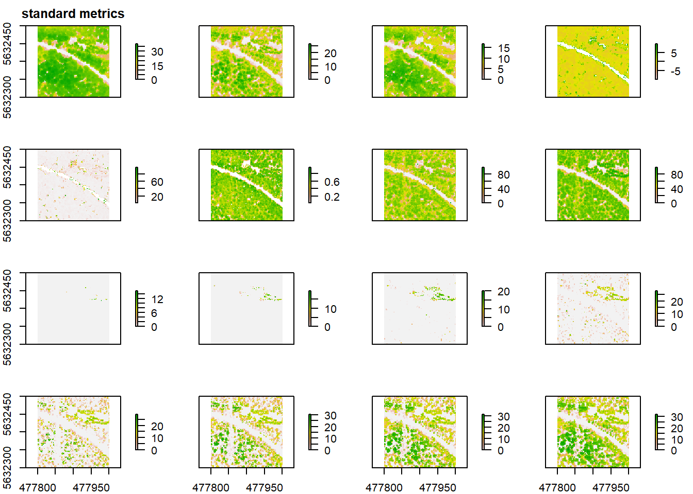
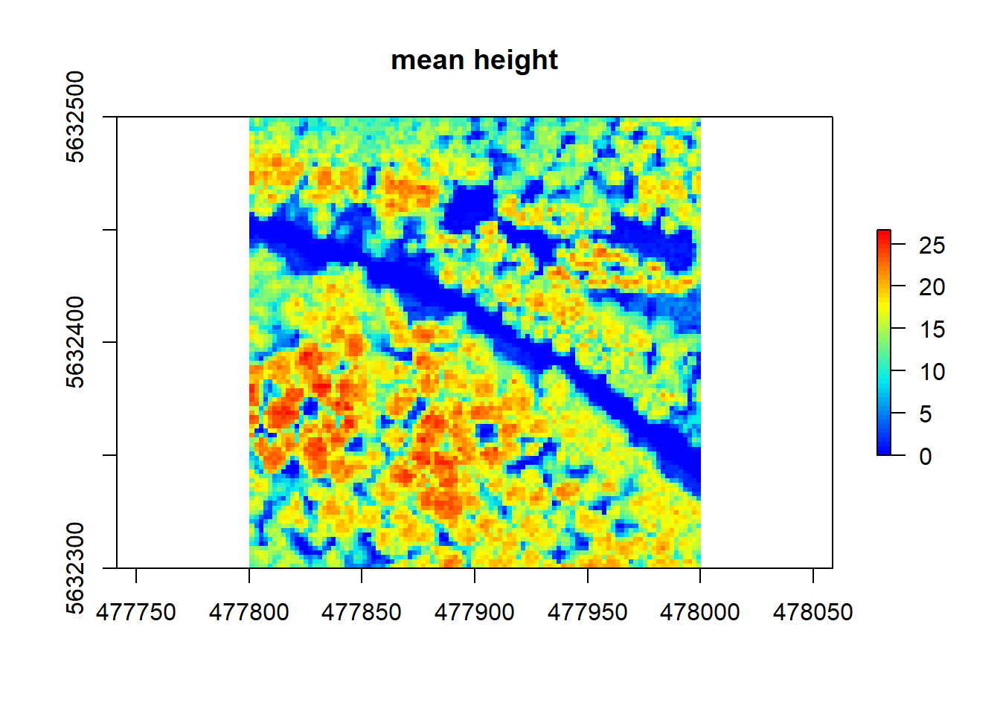
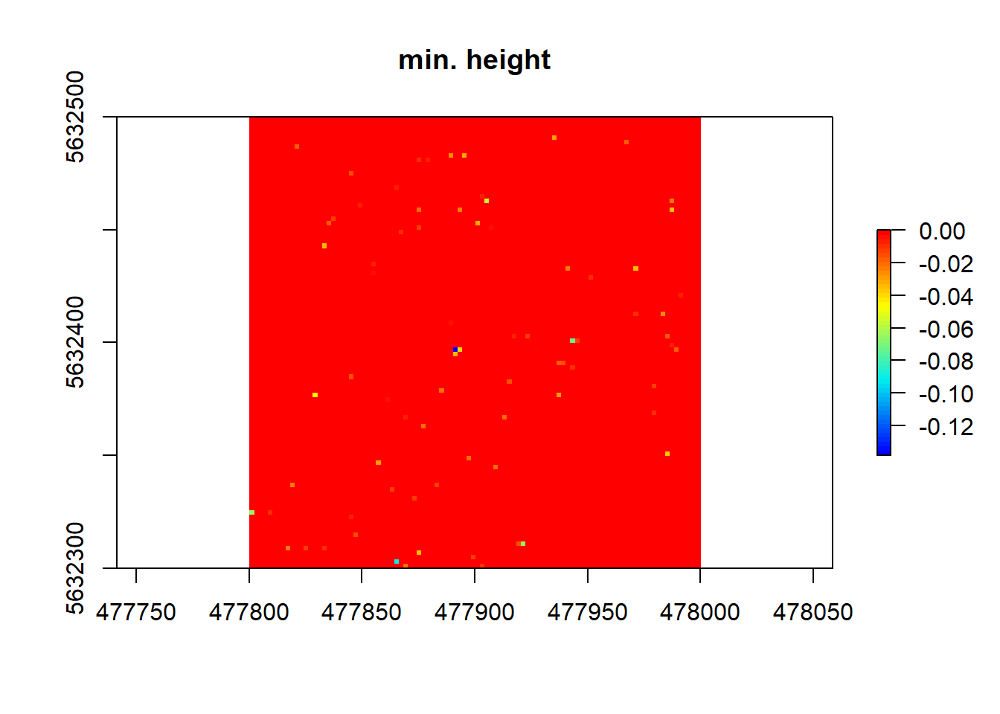

# Deriving ecological indices from LiDAR data (second approach)

## Research Question:

Is it possible to derive a suitable set of predictor variables from LiDAR 
data to obtain a reliable prediction of the microclimate parameters temperature and humidity?'

## Task:

* Read the ressources related to forest and identify those which you will use for attempting the task.
* Decide which algorithms and indices are adequate to answer the research question
* Apply and document this findings with on base of the scripts of the this unit experiences 

The Paper  "Compatibility of Aerial and Terrestrial LiDAR for
Quantifying Forest Structural Diversity" by LaRue et al. (2020) thematizes mainly the comparison of airial (ALS) and teresstrial (TLS) LiDAR techniques for quantifying forest structural diversity since Structural Diversity is, as they state, a "key feautrue of forest ecosystems" (LaRue, 2020, S.1).
Structural Diversity therefore also can be used to predict microclimate (ebd., S.1). Their findings "indicated that aerial LiDAR could be of use in quantifying broad-scale variation in structural diversity across macroscales (ebd., S.1). So according to LaRue et al. (2020), our Research question should be answered with yes, it is possible. In their supplementary material, LaRue et al. list many different metrics for structural diversity and how they are calculated in R. This will be usefull later on.

To find the right predictors to obtain a prediction of temperature and humidity, I additionally studied chapter 8 of "The lidR package by Jean-Romain Roussel, Tristan R.H. Goodbody, Piotr Tompalski 2021-01-15" and tried some of the mentioned metrics as follows. Also the review "Lidar data as indicators for forest biological diversity: a review" by Ida Marielle Mienna et al.(2018) helped to get an overview of different possible predictor variables.
 

## Setup:


```r
# activate envimaR package
require(envimaR)

# set root directory
rootDIR = "E:/edu/agis"

appendpackagesToLoad = c("lidR","forestr","lmom", "rLiDAR", "mapview", "raster", "rlas", "sp", "sf","tiff","raster", "rgl","future")

# define additional subfolders comment if not needed
appendProjectDirList =  c("data/lidar/","data/lidar/l_raster","data/lidar/l_raw","data/lidar/l_norm")

## define current projection (It is not magic you need to check the meta data or ask your instructor) 
## ETRS89 / UTM zone 32N
proj4 = "+proj=utm +zone=32 +datum=WGS84 +units=m +no_defs +ellps=WGS84 +towgs84=0,0,0"
epsg_number = 25832

# load setup Skript
source(file.path(envimaR::alternativeEnvi(root_folder = rootDIR),"src/agis_setup.R"),echo = TRUE)
```

If I wanted to use a LAS file (not a catalog):

```r
#---- Get all *.las files of a folder into a list
las_files = list.files(envrmt$path_l_raw,
                       pattern = glob2rx("*.las"),
                       full.names = TRUE)

las = lidR::readLAS(las_files[1])
las
```

```
## class        : LAS (v1.3 format 1)
## memory       : 2 Gb 
## extent       : 477500, 478217.5, 5631730, 5632500 (xmin, xmax, ymin, ymax)
## coord. ref.  : NA 
## area         : 0.55 kunits²
## points       : 26.35 million points
## density      : 47.7 points/units²
```

Creating LASCatalog and normalizing the data:

```r
# clean data
future::plan(future::multisession)
ctg <- lidR::readLAScatalog(las_files[1])
lidR::projection(ctg) <- 25832
lidR::opt_chunk_size(ctg) = 100
lidR::opt_chunk_buffer(ctg) <- 5
lidR::opt_progress(ctg) <- FALSE
lidR::opt_laz_compression(ctg) <- TRUE
ctg@output_options$drivers$Raster$param$overwrite <- TRUE

# calculate digital elevation model (DEM)
lidR::opt_output_files(ctg) <- paste0(envrmt$path_l_raster,"/","MOF_lidar_2018","/{ID}","_dsm")
dem <- grid_terrain(ctg, res = 2,lidR::knnidw(k = 6L, p = 2))
  
#- normalize height (point cloud)
# Subtract digital terrain model (DTM =DEM?!?) from LiDAR point cloud
lidR::opt_output_files(ctg) <- paste0(envrmt$path_l_norm,"/{ID}","_norm_height")
ctg_n=lidR::normalize_height(ctg,lidR::tin())
```


Use only four tiles of the normalized catalog to minimize computing time:

```r
ctg_n <- readLAScatalog(file.path(envrmt$path_l_norm, "Ausschnitt_las"))

# reassign the projection
sp::proj4string(ctg_n) <- sp::CRS(proj4)

# visualize
ctg_n
```

```
## class       : LAScatalog (v1.3 format 1)
## extent      : 477800, 478000, 5632300, 5632500 (xmin, xmax, ymin, ymax)
## coord. ref. : +proj=utm +zone=32 +datum=WGS84 +units=m +no_defs 
## area        : 39999.2 m²
## points      : 2.23million points
## density     : 55.8 points/m²
## num. files  : 4
```

```r
mapview::mapview(ctg_n)
```

```{=html}
<div id="htmlwidget-dacc5adb954f139629d2" style="width:672px;height:480px;" class="leaflet html-widget"></div>
<script type="application/json" data-for="htmlwidget-dacc5adb954f139629d2">{"x":{"options":{"minZoom":1,"maxZoom":52,"crs":{"crsClass":"L.CRS.EPSG3857","code":null,"proj4def":null,"projectedBounds":null,"options":{}},"preferCanvas":false,"bounceAtZoomLimits":false,"maxBounds":[[[-90,-370]],[[90,370]]]},"calls":[{"method":"addProviderTiles","args":["CartoDB.Positron","CartoDB.Positron","CartoDB.Positron",{"errorTileUrl":"","noWrap":false,"detectRetina":false,"pane":"tilePane"}]},{"method":"addProviderTiles","args":["CartoDB.DarkMatter","CartoDB.DarkMatter","CartoDB.DarkMatter",{"errorTileUrl":"","noWrap":false,"detectRetina":false,"pane":"tilePane"}]},{"method":"addProviderTiles","args":["OpenStreetMap","OpenStreetMap","OpenStreetMap",{"errorTileUrl":"","noWrap":false,"detectRetina":false,"pane":"tilePane"}]},{"method":"addProviderTiles","args":["Esri.WorldImagery","Esri.WorldImagery","Esri.WorldImagery",{"errorTileUrl":"","noWrap":false,"detectRetina":false,"pane":"tilePane"}]},{"method":"addProviderTiles","args":["OpenTopoMap","OpenTopoMap","OpenTopoMap",{"errorTileUrl":"","noWrap":false,"detectRetina":false,"pane":"tilePane"}]},{"method":"createMapPane","args":["polygon",420]},{"method":"addPolygons","args":[[[[{"lng":[8.68469315800067,8.68468709726627,8.68610738863364,8.68611342206924,8.68469315800067],"lat":[50.8419793501346,50.8428786019404,50.8428824307262,50.8419831787984,50.8419793501346]}]],[[{"lng":[8.68611343627203,8.6861074028367,8.68752769451314,8.68753370064965,8.68611343627203],"lat":[50.8419831788366,50.8428824307644,50.842886242265,50.8419869902159,50.8419831788366]}]],[[{"lng":[8.68468709720566,8.6846810361608,8.68610135482864,8.68610738857331,8.68468709720566],"lat":[50.842878610933,50.843777862599,50.8437816915067,50.8428824397188,50.842878610933]}]],[[{"lng":[8.68610740277636,8.68610136903197,8.6875216880089,8.68752769445308,8.68610740277636],"lat":[50.842882439757,50.8437816915449,50.843785503167,50.8428862512577,50.842882439757]}]]],null,"ctg_n",{"crs":{"crsClass":"L.CRS.EPSG3857","code":null,"proj4def":null,"projectedBounds":null,"options":{}},"pane":"polygon","stroke":true,"color":"#333333","weight":0.5,"opacity":0.9,"fill":true,"fillColor":"#6666FF","fillOpacity":0.6,"smoothFactor":1,"noClip":false},["<div class='scrollableContainer'><table class=mapview-popup id='popup'><tr class='coord'><td><\/td><th><b>Feature ID&emsp;<\/b><\/th><td>1&emsp;<\/td><\/tr><tr><td>1<\/td><th>File.Signature&emsp;<\/th><td>LASF&emsp;<\/td><\/tr><tr><td>2<\/td><th>File.Source.ID&emsp;<\/th><td>0&emsp;<\/td><\/tr><tr><td>3<\/td><th>GUID&emsp;<\/th><td>00000000-0000-0000-0000-000000000000&emsp;<\/td><\/tr><tr><td>4<\/td><th>Version.Major&emsp;<\/th><td>1&emsp;<\/td><\/tr><tr><td>5<\/td><th>Version.Minor&emsp;<\/th><td>3&emsp;<\/td><\/tr><tr><td>6<\/td><th>System.Identifier&emsp;<\/th><td>&emsp;<\/td><\/tr><tr><td>7<\/td><th>Generating.Software&emsp;<\/th><td>rlas R package&emsp;<\/td><\/tr><tr><td>8<\/td><th>File.Creation.Day.of.Year&emsp;<\/th><td>0&emsp;<\/td><\/tr><tr><td>9<\/td><th>File.Creation.Year&emsp;<\/th><td>2018&emsp;<\/td><\/tr><tr><td>10<\/td><th>Header.Size&emsp;<\/th><td>235&emsp;<\/td><\/tr><tr><td>11<\/td><th>Offset.to.point.data&emsp;<\/th><td>235&emsp;<\/td><\/tr><tr><td>12<\/td><th>Number.of.variable.length.records&emsp;<\/th><td>0&emsp;<\/td><\/tr><tr><td>13<\/td><th>Point.Data.Format.ID&emsp;<\/th><td>1&emsp;<\/td><\/tr><tr><td>14<\/td><th>Point.Data.Record.Length&emsp;<\/th><td>28&emsp;<\/td><\/tr><tr><td>15<\/td><th>Number.of.point.records&emsp;<\/th><td>617732&emsp;<\/td><\/tr><tr><td>16<\/td><th>X.scale.factor&emsp;<\/th><td>0.001&emsp;<\/td><\/tr><tr><td>17<\/td><th>Y.scale.factor&emsp;<\/th><td>0.001&emsp;<\/td><\/tr><tr><td>18<\/td><th>Z.scale.factor&emsp;<\/th><td>0.001&emsp;<\/td><\/tr><tr><td>19<\/td><th>X.offset&emsp;<\/th><td>4e+05&emsp;<\/td><\/tr><tr><td>20<\/td><th>Y.offset&emsp;<\/th><td>5e+06&emsp;<\/td><\/tr><tr><td>21<\/td><th>Z.offset&emsp;<\/th><td>0&emsp;<\/td><\/tr><tr><td>22<\/td><th>Max.X&emsp;<\/th><td>477900&emsp;<\/td><\/tr><tr><td>23<\/td><th>Min.X&emsp;<\/th><td>477800&emsp;<\/td><\/tr><tr><td>24<\/td><th>Max.Y&emsp;<\/th><td>5632400&emsp;<\/td><\/tr><tr><td>25<\/td><th>Min.Y&emsp;<\/th><td>5632300&emsp;<\/td><\/tr><tr><td>26<\/td><th>Max.Z&emsp;<\/th><td>38.023&emsp;<\/td><\/tr><tr><td>27<\/td><th>Min.Z&emsp;<\/th><td>-0.138&emsp;<\/td><\/tr><tr><td>28<\/td><th>CRS&emsp;<\/th><td>0&emsp;<\/td><\/tr><tr><td>29<\/td><th>Number.of.1st.return&emsp;<\/th><td>202803&emsp;<\/td><\/tr><tr><td>30<\/td><th>Number.of.2nd.return&emsp;<\/th><td>183529&emsp;<\/td><\/tr><tr><td>31<\/td><th>Number.of.3rd.return&emsp;<\/th><td>134968&emsp;<\/td><\/tr><tr><td>32<\/td><th>Number.of.4th.return&emsp;<\/th><td>69786&emsp;<\/td><\/tr><tr><td>33<\/td><th>Number.of.5th.return&emsp;<\/th><td>21989&emsp;<\/td><\/tr><tr><td>34<\/td><th>filename&emsp;<\/th><td>E:/edu/agis/data/lidar/l_norm/Ausschnitt_las/52_norm_height.laz&emsp;<\/td><\/tr><tr><td>35<\/td><th>geometry&emsp;<\/th><td>sfc_POLYGON&emsp;<\/td><\/tr><\/table><\/div>","<div class='scrollableContainer'><table class=mapview-popup id='popup'><tr class='coord'><td><\/td><th><b>Feature ID&emsp;<\/b><\/th><td>2&emsp;<\/td><\/tr><tr><td>1<\/td><th>File.Signature&emsp;<\/th><td>LASF&emsp;<\/td><\/tr><tr><td>2<\/td><th>File.Source.ID&emsp;<\/th><td>0&emsp;<\/td><\/tr><tr><td>3<\/td><th>GUID&emsp;<\/th><td>00000000-0000-0000-0000-000000000000&emsp;<\/td><\/tr><tr><td>4<\/td><th>Version.Major&emsp;<\/th><td>1&emsp;<\/td><\/tr><tr><td>5<\/td><th>Version.Minor&emsp;<\/th><td>3&emsp;<\/td><\/tr><tr><td>6<\/td><th>System.Identifier&emsp;<\/th><td>&emsp;<\/td><\/tr><tr><td>7<\/td><th>Generating.Software&emsp;<\/th><td>rlas R package&emsp;<\/td><\/tr><tr><td>8<\/td><th>File.Creation.Day.of.Year&emsp;<\/th><td>0&emsp;<\/td><\/tr><tr><td>9<\/td><th>File.Creation.Year&emsp;<\/th><td>2018&emsp;<\/td><\/tr><tr><td>10<\/td><th>Header.Size&emsp;<\/th><td>235&emsp;<\/td><\/tr><tr><td>11<\/td><th>Offset.to.point.data&emsp;<\/th><td>235&emsp;<\/td><\/tr><tr><td>12<\/td><th>Number.of.variable.length.records&emsp;<\/th><td>0&emsp;<\/td><\/tr><tr><td>13<\/td><th>Point.Data.Format.ID&emsp;<\/th><td>1&emsp;<\/td><\/tr><tr><td>14<\/td><th>Point.Data.Record.Length&emsp;<\/th><td>28&emsp;<\/td><\/tr><tr><td>15<\/td><th>Number.of.point.records&emsp;<\/th><td>619717&emsp;<\/td><\/tr><tr><td>16<\/td><th>X.scale.factor&emsp;<\/th><td>0.001&emsp;<\/td><\/tr><tr><td>17<\/td><th>Y.scale.factor&emsp;<\/th><td>0.001&emsp;<\/td><\/tr><tr><td>18<\/td><th>Z.scale.factor&emsp;<\/th><td>0.001&emsp;<\/td><\/tr><tr><td>19<\/td><th>X.offset&emsp;<\/th><td>4e+05&emsp;<\/td><\/tr><tr><td>20<\/td><th>Y.offset&emsp;<\/th><td>5e+06&emsp;<\/td><\/tr><tr><td>21<\/td><th>Z.offset&emsp;<\/th><td>0&emsp;<\/td><\/tr><tr><td>22<\/td><th>Max.X&emsp;<\/th><td>478000&emsp;<\/td><\/tr><tr><td>23<\/td><th>Min.X&emsp;<\/th><td>477900&emsp;<\/td><\/tr><tr><td>24<\/td><th>Max.Y&emsp;<\/th><td>5632400&emsp;<\/td><\/tr><tr><td>25<\/td><th>Min.Y&emsp;<\/th><td>5632300&emsp;<\/td><\/tr><tr><td>26<\/td><th>Max.Z&emsp;<\/th><td>34.943&emsp;<\/td><\/tr><tr><td>27<\/td><th>Min.Z&emsp;<\/th><td>-0.066&emsp;<\/td><\/tr><tr><td>28<\/td><th>CRS&emsp;<\/th><td>0&emsp;<\/td><\/tr><tr><td>29<\/td><th>Number.of.1st.return&emsp;<\/th><td>227179&emsp;<\/td><\/tr><tr><td>30<\/td><th>Number.of.2nd.return&emsp;<\/th><td>177396&emsp;<\/td><\/tr><tr><td>31<\/td><th>Number.of.3rd.return&emsp;<\/th><td>125453&emsp;<\/td><\/tr><tr><td>32<\/td><th>Number.of.4th.return&emsp;<\/th><td>63947&emsp;<\/td><\/tr><tr><td>33<\/td><th>Number.of.5th.return&emsp;<\/th><td>20719&emsp;<\/td><\/tr><tr><td>34<\/td><th>filename&emsp;<\/th><td>E:/edu/agis/data/lidar/l_norm/Ausschnitt_las/53_norm_height.laz&emsp;<\/td><\/tr><tr><td>35<\/td><th>geometry&emsp;<\/th><td>sfc_POLYGON&emsp;<\/td><\/tr><\/table><\/div>","<div class='scrollableContainer'><table class=mapview-popup id='popup'><tr class='coord'><td><\/td><th><b>Feature ID&emsp;<\/b><\/th><td>3&emsp;<\/td><\/tr><tr><td>1<\/td><th>File.Signature&emsp;<\/th><td>LASF&emsp;<\/td><\/tr><tr><td>2<\/td><th>File.Source.ID&emsp;<\/th><td>0&emsp;<\/td><\/tr><tr><td>3<\/td><th>GUID&emsp;<\/th><td>00000000-0000-0000-0000-000000000000&emsp;<\/td><\/tr><tr><td>4<\/td><th>Version.Major&emsp;<\/th><td>1&emsp;<\/td><\/tr><tr><td>5<\/td><th>Version.Minor&emsp;<\/th><td>3&emsp;<\/td><\/tr><tr><td>6<\/td><th>System.Identifier&emsp;<\/th><td>&emsp;<\/td><\/tr><tr><td>7<\/td><th>Generating.Software&emsp;<\/th><td>rlas R package&emsp;<\/td><\/tr><tr><td>8<\/td><th>File.Creation.Day.of.Year&emsp;<\/th><td>0&emsp;<\/td><\/tr><tr><td>9<\/td><th>File.Creation.Year&emsp;<\/th><td>2018&emsp;<\/td><\/tr><tr><td>10<\/td><th>Header.Size&emsp;<\/th><td>235&emsp;<\/td><\/tr><tr><td>11<\/td><th>Offset.to.point.data&emsp;<\/th><td>235&emsp;<\/td><\/tr><tr><td>12<\/td><th>Number.of.variable.length.records&emsp;<\/th><td>0&emsp;<\/td><\/tr><tr><td>13<\/td><th>Point.Data.Format.ID&emsp;<\/th><td>1&emsp;<\/td><\/tr><tr><td>14<\/td><th>Point.Data.Record.Length&emsp;<\/th><td>28&emsp;<\/td><\/tr><tr><td>15<\/td><th>Number.of.point.records&emsp;<\/th><td>523771&emsp;<\/td><\/tr><tr><td>16<\/td><th>X.scale.factor&emsp;<\/th><td>0.001&emsp;<\/td><\/tr><tr><td>17<\/td><th>Y.scale.factor&emsp;<\/th><td>0.001&emsp;<\/td><\/tr><tr><td>18<\/td><th>Z.scale.factor&emsp;<\/th><td>0.001&emsp;<\/td><\/tr><tr><td>19<\/td><th>X.offset&emsp;<\/th><td>4e+05&emsp;<\/td><\/tr><tr><td>20<\/td><th>Y.offset&emsp;<\/th><td>5e+06&emsp;<\/td><\/tr><tr><td>21<\/td><th>Z.offset&emsp;<\/th><td>0&emsp;<\/td><\/tr><tr><td>22<\/td><th>Max.X&emsp;<\/th><td>477900&emsp;<\/td><\/tr><tr><td>23<\/td><th>Min.X&emsp;<\/th><td>477800&emsp;<\/td><\/tr><tr><td>24<\/td><th>Max.Y&emsp;<\/th><td>5632500&emsp;<\/td><\/tr><tr><td>25<\/td><th>Min.Y&emsp;<\/th><td>5632400&emsp;<\/td><\/tr><tr><td>26<\/td><th>Max.Z&emsp;<\/th><td>35.831&emsp;<\/td><\/tr><tr><td>27<\/td><th>Min.Z&emsp;<\/th><td>-0.035&emsp;<\/td><\/tr><tr><td>28<\/td><th>CRS&emsp;<\/th><td>0&emsp;<\/td><\/tr><tr><td>29<\/td><th>Number.of.1st.return&emsp;<\/th><td>194894&emsp;<\/td><\/tr><tr><td>30<\/td><th>Number.of.2nd.return&emsp;<\/th><td>149957&emsp;<\/td><\/tr><tr><td>31<\/td><th>Number.of.3rd.return&emsp;<\/th><td>105767&emsp;<\/td><\/tr><tr><td>32<\/td><th>Number.of.4th.return&emsp;<\/th><td>52396&emsp;<\/td><\/tr><tr><td>33<\/td><th>Number.of.5th.return&emsp;<\/th><td>16461&emsp;<\/td><\/tr><tr><td>34<\/td><th>filename&emsp;<\/th><td>E:/edu/agis/data/lidar/l_norm/Ausschnitt_las/60_norm_height.laz&emsp;<\/td><\/tr><tr><td>35<\/td><th>geometry&emsp;<\/th><td>sfc_POLYGON&emsp;<\/td><\/tr><\/table><\/div>","<div class='scrollableContainer'><table class=mapview-popup id='popup'><tr class='coord'><td><\/td><th><b>Feature ID&emsp;<\/b><\/th><td>4&emsp;<\/td><\/tr><tr><td>1<\/td><th>File.Signature&emsp;<\/th><td>LASF&emsp;<\/td><\/tr><tr><td>2<\/td><th>File.Source.ID&emsp;<\/th><td>0&emsp;<\/td><\/tr><tr><td>3<\/td><th>GUID&emsp;<\/th><td>00000000-0000-0000-0000-000000000000&emsp;<\/td><\/tr><tr><td>4<\/td><th>Version.Major&emsp;<\/th><td>1&emsp;<\/td><\/tr><tr><td>5<\/td><th>Version.Minor&emsp;<\/th><td>3&emsp;<\/td><\/tr><tr><td>6<\/td><th>System.Identifier&emsp;<\/th><td>&emsp;<\/td><\/tr><tr><td>7<\/td><th>Generating.Software&emsp;<\/th><td>rlas R package&emsp;<\/td><\/tr><tr><td>8<\/td><th>File.Creation.Day.of.Year&emsp;<\/th><td>0&emsp;<\/td><\/tr><tr><td>9<\/td><th>File.Creation.Year&emsp;<\/th><td>2018&emsp;<\/td><\/tr><tr><td>10<\/td><th>Header.Size&emsp;<\/th><td>235&emsp;<\/td><\/tr><tr><td>11<\/td><th>Offset.to.point.data&emsp;<\/th><td>235&emsp;<\/td><\/tr><tr><td>12<\/td><th>Number.of.variable.length.records&emsp;<\/th><td>0&emsp;<\/td><\/tr><tr><td>13<\/td><th>Point.Data.Format.ID&emsp;<\/th><td>1&emsp;<\/td><\/tr><tr><td>14<\/td><th>Point.Data.Record.Length&emsp;<\/th><td>28&emsp;<\/td><\/tr><tr><td>15<\/td><th>Number.of.point.records&emsp;<\/th><td>472404&emsp;<\/td><\/tr><tr><td>16<\/td><th>X.scale.factor&emsp;<\/th><td>0.001&emsp;<\/td><\/tr><tr><td>17<\/td><th>Y.scale.factor&emsp;<\/th><td>0.001&emsp;<\/td><\/tr><tr><td>18<\/td><th>Z.scale.factor&emsp;<\/th><td>0.001&emsp;<\/td><\/tr><tr><td>19<\/td><th>X.offset&emsp;<\/th><td>4e+05&emsp;<\/td><\/tr><tr><td>20<\/td><th>Y.offset&emsp;<\/th><td>5e+06&emsp;<\/td><\/tr><tr><td>21<\/td><th>Z.offset&emsp;<\/th><td>0&emsp;<\/td><\/tr><tr><td>22<\/td><th>Max.X&emsp;<\/th><td>478000&emsp;<\/td><\/tr><tr><td>23<\/td><th>Min.X&emsp;<\/th><td>477900&emsp;<\/td><\/tr><tr><td>24<\/td><th>Max.Y&emsp;<\/th><td>5632500&emsp;<\/td><\/tr><tr><td>25<\/td><th>Min.Y&emsp;<\/th><td>5632400&emsp;<\/td><\/tr><tr><td>26<\/td><th>Max.Z&emsp;<\/th><td>35.440&emsp;<\/td><\/tr><tr><td>27<\/td><th>Min.Z&emsp;<\/th><td>-0.074&emsp;<\/td><\/tr><tr><td>28<\/td><th>CRS&emsp;<\/th><td>0&emsp;<\/td><\/tr><tr><td>29<\/td><th>Number.of.1st.return&emsp;<\/th><td>197804&emsp;<\/td><\/tr><tr><td>30<\/td><th>Number.of.2nd.return&emsp;<\/th><td>141318&emsp;<\/td><\/tr><tr><td>31<\/td><th>Number.of.3rd.return&emsp;<\/th><td> 84505&emsp;<\/td><\/tr><tr><td>32<\/td><th>Number.of.4th.return&emsp;<\/th><td>36233&emsp;<\/td><\/tr><tr><td>33<\/td><th>Number.of.5th.return&emsp;<\/th><td>10224&emsp;<\/td><\/tr><tr><td>34<\/td><th>filename&emsp;<\/th><td>E:/edu/agis/data/lidar/l_norm/Ausschnitt_las/61_norm_height.laz&emsp;<\/td><\/tr><tr><td>35<\/td><th>geometry&emsp;<\/th><td>sfc_POLYGON&emsp;<\/td><\/tr><\/table><\/div>"],{"maxWidth":800,"minWidth":50,"autoPan":true,"keepInView":false,"closeButton":true,"closeOnClick":true,"className":""},["1","2","3","4"],{"interactive":false,"permanent":false,"direction":"auto","opacity":1,"offset":[0,0],"textsize":"10px","textOnly":false,"className":"","sticky":true},{"stroke":true,"weight":1,"opacity":0.9,"fillOpacity":0.84,"bringToFront":false,"sendToBack":false}]},{"method":"addScaleBar","args":[{"maxWidth":100,"metric":true,"imperial":true,"updateWhenIdle":true,"position":"bottomleft"}]},{"method":"addHomeButton","args":[8.6846810361608,50.8419793501346,8.68753370064965,50.843785503167,true,"ctg_n","Zoom to ctg_n","<strong> ctg_n <\/strong>","bottomright"]},{"method":"addLayersControl","args":[["CartoDB.Positron","CartoDB.DarkMatter","OpenStreetMap","Esri.WorldImagery","OpenTopoMap"],"ctg_n",{"collapsed":true,"autoZIndex":true,"position":"topleft"}]},{"method":"addLegend","args":[{"colors":["#6666FF"],"labels":["ctg_n"],"na_color":null,"na_label":"NA","opacity":1,"position":"topright","type":"factor","title":"","extra":null,"layerId":null,"className":"info legend","group":"ctg_n"}]}],"limits":{"lat":[50.8419793501346,50.843785503167],"lng":[8.6846810361608,8.68753370064965]},"fitBounds":[50.8419793501346,8.6846810361608,50.843785503167,8.68753370064965,[]]},"evals":[],"jsHooks":{"render":[{"code":"function(el, x, data) {\n  return (\n      function(el, x, data) {\n      // get the leaflet map\n      var map = this; //HTMLWidgets.find('#' + el.id);\n      // we need a new div element because we have to handle\n      // the mouseover output separately\n      // debugger;\n      function addElement () {\n      // generate new div Element\n      var newDiv = $(document.createElement('div'));\n      // append at end of leaflet htmlwidget container\n      $(el).append(newDiv);\n      //provide ID and style\n      newDiv.addClass('lnlt');\n      newDiv.css({\n      'position': 'relative',\n      'bottomleft':  '0px',\n      'background-color': 'rgba(255, 255, 255, 0.7)',\n      'box-shadow': '0 0 2px #bbb',\n      'background-clip': 'padding-box',\n      'margin': '0',\n      'padding-left': '5px',\n      'color': '#333',\n      'font': '9px/1.5 \"Helvetica Neue\", Arial, Helvetica, sans-serif',\n      'z-index': '700',\n      });\n      return newDiv;\n      }\n\n\n      // check for already existing lnlt class to not duplicate\n      var lnlt = $(el).find('.lnlt');\n\n      if(!lnlt.length) {\n      lnlt = addElement();\n\n      // grab the special div we generated in the beginning\n      // and put the mousmove output there\n\n      map.on('mousemove', function (e) {\n      if (e.originalEvent.ctrlKey) {\n      if (document.querySelector('.lnlt') === null) lnlt = addElement();\n      lnlt.text(\n                           ' lon: ' + (e.latlng.lng).toFixed(5) +\n                           ' | lat: ' + (e.latlng.lat).toFixed(5) +\n                           ' | zoom: ' + map.getZoom() +\n                           ' | x: ' + L.CRS.EPSG3857.project(e.latlng).x.toFixed(0) +\n                           ' | y: ' + L.CRS.EPSG3857.project(e.latlng).y.toFixed(0) +\n                           ' | epsg: 3857 ' +\n                           ' | proj4: +proj=merc +a=6378137 +b=6378137 +lat_ts=0.0 +lon_0=0.0 +x_0=0.0 +y_0=0 +k=1.0 +units=m +nadgrids=@null +no_defs ');\n      } else {\n      if (document.querySelector('.lnlt') === null) lnlt = addElement();\n      lnlt.text(\n                      ' lon: ' + (e.latlng.lng).toFixed(5) +\n                      ' | lat: ' + (e.latlng.lat).toFixed(5) +\n                      ' | zoom: ' + map.getZoom() + ' ');\n      }\n      });\n\n      // remove the lnlt div when mouse leaves map\n      map.on('mouseout', function (e) {\n      var strip = document.querySelector('.lnlt');\n      if( strip !==null) strip.remove();\n      });\n\n      };\n\n      //$(el).keypress(67, function(e) {\n      map.on('preclick', function(e) {\n      if (e.originalEvent.ctrlKey) {\n      if (document.querySelector('.lnlt') === null) lnlt = addElement();\n      lnlt.text(\n                      ' lon: ' + (e.latlng.lng).toFixed(5) +\n                      ' | lat: ' + (e.latlng.lat).toFixed(5) +\n                      ' | zoom: ' + map.getZoom() + ' ');\n      var txt = document.querySelector('.lnlt').textContent;\n      console.log(txt);\n      //txt.innerText.focus();\n      //txt.select();\n      setClipboardText('\"' + txt + '\"');\n      }\n      });\n\n      }\n      ).call(this.getMap(), el, x, data);\n}","data":null},{"code":"function(el, x, data) {\n  return (function(el,x,data){\n           var map = this;\n\n           map.on('keypress', function(e) {\n               console.log(e.originalEvent.code);\n               var key = e.originalEvent.code;\n               if (key === 'KeyE') {\n                   var bb = this.getBounds();\n                   var txt = JSON.stringify(bb);\n                   console.log(txt);\n\n                   setClipboardText('\\'' + txt + '\\'');\n               }\n           })\n        }).call(this.getMap(), el, x, data);\n}","data":null}]}}</script>
```

## Metrics:

The following metrics will be calculated: 
* DEM
* CHM
* standard metrics from lidR package
* mean height (of height normalized data)
* standard deviation and mean of intensity
* point density

Read in the same four tiles as for ctg_n, but of the digital elevation model (DEM) and create one raster by merging the four tiles:

```r
dem_small <- list.files( file.path(envrmt$path_l_raster,"MOF_lidar_2018", "Ausschnitt_tif"), pattern="*.tif")
dem_small
```

```
## [1] "52_dsm.tif" "53_dsm.tif" "60_dsm.tif" "61_dsm.tif"
```

```r
dem <- list()

for(i in 1:length(dem_small)) {
  dem[[i]] <- raster(paste0(envrmt$path_l_raster, "/MOF_lidar_2018/", "Ausschnitt_tif/", dem_small[i]))
}
dem
```

```
## [[1]]
## class      : RasterLayer 
## dimensions : 50, 50, 2500  (nrow, ncol, ncell)
## resolution : 2, 2  (x, y)
## extent     : 477800, 477900, 5632300, 5632400  (xmin, xmax, ymin, ymax)
## crs        : +proj=utm +zone=32 +ellps=GRS80 +units=m +no_defs 
## source     : 52_dsm.tif 
## names      : X52_dsm 
## values     : 247.825, 268.293  (min, max)
## 
## 
## [[2]]
## class      : RasterLayer 
## dimensions : 50, 50, 2500  (nrow, ncol, ncell)
## resolution : 2, 2  (x, y)
## extent     : 477900, 478000, 5632300, 5632400  (xmin, xmax, ymin, ymax)
## crs        : +proj=utm +zone=32 +ellps=GRS80 +units=m +no_defs 
## source     : 53_dsm.tif 
## names      : X53_dsm 
## values     : 247.981, 265.108  (min, max)
## 
## 
## [[3]]
## class      : RasterLayer 
## dimensions : 50, 50, 2500  (nrow, ncol, ncell)
## resolution : 2, 2  (x, y)
## extent     : 477800, 477900, 5632400, 5632500  (xmin, xmax, ymin, ymax)
## crs        : +proj=utm +zone=32 +ellps=GRS80 +units=m +no_defs 
## source     : 60_dsm.tif 
## names      : X60_dsm 
## values     : 237.308, 258.168  (min, max)
## 
## 
## [[4]]
## class      : RasterLayer 
## dimensions : 50, 50, 2500  (nrow, ncol, ncell)
## resolution : 2, 2  (x, y)
## extent     : 477900, 478000, 5632400, 5632500  (xmin, xmax, ymin, ymax)
## crs        : +proj=utm +zone=32 +ellps=GRS80 +units=m +no_defs 
## source     : 61_dsm.tif 
## names      : X61_dsm 
## values     : 242.494, 263.087  (min, max)
```

```r
dem <- do.call(merge, dem)
plot(dem, main ="digital elevation model")
```


```r
extent(ctg_n)
```

```
## class      : Extent 
## xmin       : 477800 
## xmax       : 478000 
## ymin       : 5632300 
## ymax       : 5632500
```

```r
extent(dem)
```

```
## class      : Extent 
## xmin       : 477800 
## xmax       : 478000 
## ymin       : 5632300 
## ymax       : 5632500
```

CHM:

```r
# calculate the chm with the pitfree algorithm
chm = lidR::grid_canopy(ctg_n, 
                        2, 
                        pitfree(c(0,2,5,10,15), 
                        c(0,1), 
                        subcircle = 0.2))
```


```
## Chunk 1 of 4 (25%): state <U+2713>
## Chunk 2 of 4 (50%): state <U+2713>
## Chunk 3 of 4 (75%): state <U+2713>
## Chunk 4 of 4 (100%): state <U+2713>
```

```r
# write it to tif
#raster::writeRaster(chm,file.path(envrmt$path_l_raster,"mof_chm_four_tiles.tif"),overwrite=TRUE) 

# visualize with mapview:
mapview::mapview(chm,
                   legend=TRUE, 
                   layer.name = "canopy height model",
                   col = mvTop(256))
```

```{=html}
<div id="htmlwidget-885a6cfe1063f2f26aba" style="width:672px;height:480px;" class="leaflet html-widget"></div>
<script type="application/json" data-for="htmlwidget-885a6cfe1063f2f26aba">{"x":{"options":{"minZoom":1,"maxZoom":52,"crs":{"crsClass":"L.CRS.EPSG3857","code":null,"proj4def":null,"projectedBounds":null,"options":{}},"preferCanvas":false,"bounceAtZoomLimits":false,"maxBounds":[[[-90,-370]],[[90,370]]]},"calls":[{"method":"addProviderTiles","args":["CartoDB.Positron","CartoDB.Positron","CartoDB.Positron",{"errorTileUrl":"","noWrap":false,"detectRetina":false,"pane":"tilePane"}]},{"method":"addProviderTiles","args":["CartoDB.DarkMatter","CartoDB.DarkMatter","CartoDB.DarkMatter",{"errorTileUrl":"","noWrap":false,"detectRetina":false,"pane":"tilePane"}]},{"method":"addProviderTiles","args":["OpenStreetMap","OpenStreetMap","OpenStreetMap",{"errorTileUrl":"","noWrap":false,"detectRetina":false,"pane":"tilePane"}]},{"method":"addProviderTiles","args":["Esri.WorldImagery","Esri.WorldImagery","Esri.WorldImagery",{"errorTileUrl":"","noWrap":false,"detectRetina":false,"pane":"tilePane"}]},{"method":"addProviderTiles","args":["OpenTopoMap","OpenTopoMap","OpenTopoMap",{"errorTileUrl":"","noWrap":false,"detectRetina":false,"pane":"tilePane"}]},{"method":"addRasterImage","args":["data:image/png;base64,iVBORw0KGgoAAAANSUhEUgAAAGQAAABkCAYAAABw4pVUAAAgAElEQVR4nIS9ebBt2V3f91nDHs4+4x3effeNPaq7NXW3WkJCQrLDIDm2MIZgbHBwOZZtUi6KhJhU4qmCXOW4bFy4SDkFOCkTChyCnQliIwaBBJIsIWgJTbSknvv1G+98z7DPHtaQP9ba+94HTuVUvbrvnXuGvddv/v6+v98Tv/svfsh73+K9AVrCQyFEivc13jd4v8L7BiFynFsihMK5NVIWCDHE+6Z/rxApQuR0D+9dfF7Gv3vA4X0NCM4/hFB47/G+QggFSIRI4/UohMjw3gMN3jc4d8rcrJkmm/1n1PaIVI7iNS4RIkXKLZTawHvb38+qvUMuw2dKOUKIwbnvCd8J8r5rDNek8L6mab7K8+uKQgquD2ZofQWhd1kPZwBIa1DWYJXGpDlOaVTbILwL/xYS6R3COUT86aVEhy9KekGEC5Dxy7sLyaLAmnhoDWCjULpDS+NPANu9877ngrBUFFQaP9PF18j4uUEYUk7itXggRcosHlCDcw4hMpS6wFSs4mvCdQ6S63hvce4UcPG7Tfxs0V9boS8g5TjeuwI6YZleIcPvumuw8fvprzkRNRsatH6Q9ewNNFmB8A5tGrRpgmC8I61LlGlQ7QJQlOMdAJKmwkuJMg1OatajWRBIJ4xOA8JDIoTufzq3xLl51HKN6BXHxYNX/eu9b+PFu3M/k3OHSrRAe85Suu9LgDxqrOtfG54XCOEQIo/POaQUWHtIbZekUqHUFkKMkLLAe3VOUcLBdpYl5SZSDhEii8+3UVHacwqpEELgvY333CmT7BVtr4WNQXyvlEwPbmOrLyLllGb6lnCy1qBNg/MGIRTF4h5t+ypSDpFyhpQFVjrGx3fRnQCE6L5QAgovNcKZaBFBw6w9QQiNlBvxwtYIUZzJlOSPmHx3COuocek5t6UQQp4TGICOn6ERIokHwTnNJApW0VmUc6f8wWLB77UpT6qG98wMSg2iBa7j9+RRqUqsvctBa9nJBng/PHedKgpH4Nyctn0epS6QJA9FAYl4bRIhLEIMuJjAUBeQXEY6w+T4Lmb9e/zM4YrL3OODSKqNJwFo0gIoaNOcwfw1rL2FcyOUanAuQyZXWE530Khxf6tGp0hrwt/THN1USAtQh2ORI6ScIuUougWQchDfrZCyoPO9QqTYJEe1Jc4Rb1rEg24B01sWCLz3CCGim9DxZ4hN4eCPUepiFFpwMZ37USI8cykVKHUhHhzAMCqCjkpX03rLQeu5kNbn3NhZrPK+5KvL1/mf6inv8vf4C5unpOlT8R5bnPN4v8T7JYVK0fpBnNJk6yW+eZ29+hSJYjsJZ2KTFFpoU0lVTGiygiYrmBxvIMwxTfOHeN+Qq03qfIQ2SY4yDV5K6nzUm173SNdNJy6knKH15XigdQzqXfzI73N5NslpsoIUkI2hc19B0xze92oQLUH2FhYEElyScyuMucNJu2Qrz5FyKyYNIRFR6iJvm27wlFsi5SBabINzZa/x4Zo8QqTk+gpPFHeRchS/v1OEoBhSjnm8KPhr/pQ3FglaX4vXYvG+xblT2vbrvFZ5cglXdIMXEuEdHs/F/CofGiRofYXD3cf7cxTO4aTGJDknWxOW0x2uvPIFXqvWHLSeb0xLFrOd8zEkCGI9nCGcQ7cVAEldRkUUSDnBqQHSqujKzicBmrPgGgSq23ixXWyROly49/E13WGdaWmvqVKDbeJzGRtpFv3tIHyW72ILSDlDqR2Ce6xo2xs4t0CpKVo/0F+X9xYhNErtxmu6P8sLSpGi9QO8dVIixAilNrFJjjYN3lc4d8K9xvNq7dnQcNlXSGdoswJbvKnPlsqswKlwvNbqEPt8+F2n8CbJeajY4WGRU08eYjQ/QNeDEdl6iYjpqVUaryXSGbw11PmIvKxRahtQSGdASKwcAsNwG7aKByoxOsVJjXSGpD7t9AOb5Fid4oRE2YKknvfv6QKqEAlW6l45lFPACK2vxd8PCMHdRktTeF/R+X/vG9r2FX53PicRMFWnPFq8SJI8RnCPOgZkzf1JTJdNEWPgEO8H/e87Nx4seBAsI4VNLVBqG2ENbZLjhcTpcO/Smv59w+URevUqUs5YD9+JtAbhHaebl8kH30xalzipUaZBr4ezPkdusgLhHCbLKUebDOcHCO+o2LovZ1amweoUk6R4IUnroPlWp7RJyLmzaolqq+B2VI6TOphtmtJmBSZJ0W0TFEBKlDW4aFnKml5gITMr+nqmE3A4xK6maeOfhpN2wa+ZESshudS2PF2v+NbNG2h9FSFypPRRiMm5QJ31NVAQio4W7ACHcAaPJWR1Y7YHj7OZhbRaiBQZr80pjdEpKgpDmYbh4giWn6OxR6jp+8OhtxV5OUebBhnvWzpD0lToqpjQxjjSmZjRKU5p5HAGqxO8ODMz3VQkQtKcM0nfVCRtRZ2PaNNgCcK7vvgxOggOwCZBaFZpdHuE9I5G57RZgRMy5PDlvC/qbDLsLa7TOKc0VqfopkIYYjblECJhM7vCX2xu8vE64yWRs+ENx80RM9+g9SWEGJ1Lm7sag3MFp6NLd8/XHSHO+fjeAVKO6eqVTgkBtGkQLijtcH6Luv4yL5YLpIDH09fR5irShsNP6/LMK8U4pJusQOo05MnnDs3oFC/Di9K6pE1zdHv2mvOBfz2a0bQhpTPxsN1whspCQuBFKH68kChneisAUKZBJDltnmN0ijUNyjRkFXgfNMjqFHcu3DmpwyEISW5DkdodnFKbPFHsc7OuwcMYyyuV56pfclEuUWrQJyIhMbDREuy5QlXG57vCVhIK4WUsJs9cnRCSpK36ezRpTpvkJG1F07zAi+WCExMSAPCoWDB25ye8Q3qHFRKnNNroFE1IQl2UlBOy1+gmK4J70ikqMwyWJzilcVJTD0bnJFuhTXB7VTEJH95U/ReOTvZQLpin0V31Dlm17K2yGYxonaNNc2bOkbRV//ruhruHdAbpHW02IqmJh+rx3iLliA1d87itySVkEiaqQyRCFnf2cL0gumo8BP+g/SYdoeoj6vpzrKxllj8ehRLuwcrgctOmxHuDtBqfBQ+S1Zd4ZHCK9Q1ajnH5VVx8fXcnKlpU91naxpuV0vSXKL0Da/BCYnWKjQfoZfgiLyXz2W4QoJSotmGwOiFpK6piQjWYYJVG5cHNjBYHbB7coBzOaLOC9XCGcoaqmJDWJdIamsEIK0M2Iq2mzYrgi53pYQgRheVUiEc+apWNMQtb4v2aV8ojfssUfDAtmWrBTgKpzHBuDSzOFa8dEnFWHHZuSMphH6i9nqDtVe6uX2OSnkahF0g56WMpgGprVL2PyEfBqvMrZGIAGIQYcTzd6WOmcC6EBWsQsTAObjgfodsqpLfRlUhrkBDigdIknaZbg01SVqNN6sGIXKdIAVVqkc5QjjdpsgKEJJUKF0Nh3VZ8Yu9jPDMSlI//YA/AKdNQ5yOkNZg0AJKdf23T4MKStkI4R7E8QrjgzqRt8FIjY5wSzuD9CudKvG+4msHfLjIgjaDogA7Hcu4Y70tAo9SFiJl1haOMcM4a5xTQXVMDcsobhls4d4oQFbBJB6I6qZHNAbeXn6Ny8BAJx7tPsBptAg+irMFLGVx5Fw+dCYG9qXBK0wxGNFmBlkLcl9102UHnRmwXS6wjL+dURdCKIknJYyBzHurxFlpI8ghypUpSGYvDI7zjWZPxlG9YTndo06B5iZR9AtBkRXiuDRdYjjeR1jBYnTBcHsVDr6E9om5fQ8rZOUhkEbOkCueWpPpKFAIxo+pcUYNzB9xrPHutp3Fznh4J8vRNMW128fUgRIOqj3BugZfTaDUbrNtDvF+TKYuUQ5J6ia6OeHXxOX6snPCX1CkP4XpXD+A6bxMtiZY+JHQxtXNbOl0eB7MUQYLSmj7F1aZBeke2XmJ0yvToNqP5Acoa5t7RjDdwMVXUQuLwGOcodBCUFILGtGTrJX9x1DDMHu8zCiC4BKXBOxASomCafISWEts2tNFyBssTdLXGuSW36yUfWdW8LWm4kgpu1L5HxCoHTwxKLhUPROwMQsCucW7Oa5Xn42vNL4pt3kLJxWbOA/oIKadRoCXQYq2P6G9LkjwSYaMBidB8btnimPPM6MskaoYQI1oPXziYsbed8K72a8A7+vvsMjAgWLTSNFnBYrqDiQpplSZfz9Gzw5vBrw8mmDRHWUNLyBI6/37ltS/1AGNb7PSau1L6Ply/yzZW+YgkyZBC9J9xcfNPce/KE9T5CK80uq0CdiYEGNOn1sI5VKJJpcQkGa0rQuaS5iR1BiQctZ5faC7wC86zaxrurPIgz0aC9LzHn/C3xGtcyK9Gy0kBz6kxfG3t+aiY0iw0s5GhkETg9AjnjrHesLQwkLC0UCjQ3kbsbg1IHhkITg08V3qOzDGSY37TjcAIViiESNDtWYbZPYRzAelzpo9/ToWCMK1LvJDoYnXCUmp00qCc6Ys/AN1WjE/2aNvXo8mOg4Qj5l8sjoJvlCGoFquTkKFJyfH2dZo0J7WGejDi9YefCW4ozcH7s0yrrcmqJU5qbBLATeMdTXrW5Oq0zMsUY17lX7UTfKnwjeQ2KVjwSQTHvOAzgwmvVAu2szVKXY4xwuCbfX5ObHO3zsDDU5RspWOU2sLaQxpnaH0QAtHictm1IwI6oPUVtlTDWN3i2eVZs+IhauzuIT8wWNJufnfInrzrC+YQi8xZEhN7J8JFb2RDfNRJXZIlyz7iN1kRDnt5xPhkD7H6OnvrF9lMNEnyKHmpmB1KqsGkr0yBPmiNT/YYrE4wSc5qvBmaMELikujGEBSJxjhFVZWkdRlwImH6i/dCYqJPLdZL8nIe08Oa3zlt+ezxJXwrzsqP4AuiQAAjSAYBahEixaXbOKmZNV8lx/E30rvYVPDuESTJo4SCb02uIfNNrNRTMmViN1HgfRs/LyDNmVC8Y3SDgxash2ve8KEiI8nfxZpzdUYsEiE0pPJyfh/aIZ0haStUW+F9g9Zt05fzVqfYJCWtSzbvvcB6/Sm+XHpaBw7DBXET55Zk81PycheT5NSDEaOTu7TZKOTj60OsPeTizRRdHQENxtzj8JE/h3COtZCUgxGplJBk2IjrqKg9xhqyakmTFSFlnh+wufcqVK/RugWVA5E7fKVjpurBCDAiAo7gK8lB3rWTQwpaDmeMy0f46enXY1fRodQ0or4+urY2Vv0dHC+iq66ihaiYWSmEGJCoLTY5JBEZafoozehRSp1SD0ZUg0lwRTZkU51ldPFExb87qc+5NYdeH/8KWfJd1Pmox7SmR7dZrT/Fz59oLtNyJYWVhbJaMlFLNtM1mpTUz0Iq5+bI8h7e1xgUx/WLHC+/zlfL4EZ+SWzwM/qz3Hnom2jTnFZK1lKjIhyiow9N6hLdnimHU5qtuy8jzDGtvcu/PpzzUyfX8ZXEW4FQPgK0HkyEBz0gPY/kAq13Wc52ex+t1BbD7GlcfgmvNNY5jJRIa2jTCwFDKw844wcMMWmBqvfP0mc1QjgDBG5BKgek6VupxlcwSd7HQekCwkBdklVLZHMMKLRNabMR9WAUYqh3GJNGMNKhP7vwfNvgddosdP7SuiQ9/BQ/d6L4tBjzl8URuRQcG8/tFnYTGKtDtN7tJR3ID0es29d4vvT8ZBs6ipUQpHj2SHhp/iyPvKKo3vyBYL7AcHFEUpcUqxOSuuyxHWFC9Y4qwC7x3lCaE35aXAqBGxCJBw8idYjEBxcGoD15YZjbULUPj29QD3eoixHabJGuFaqtsDaQD6zSJOVtxHoe7iNW+sFFtQFxEAO8NwGNVhqvU1Q9wvuS43aP504/yzc1Ewbj91IVkxAXyjltVpC0FbI5wdqDSLRwpI08QzmipXQKqE+c4PnTZ3nEHjEUKdbu80uHh/xbsc1JLJjutZ47VvKbYso72hXXTcsgS3uUsmvz3q7hd5uUQ6HJcVRIcgxvZM2nSskDxa2gLdaQr+d9vBHmFGsPuFW+TKFgpAuS5CGEdSEY+4pTA76UiMzhXYgTOBEzK4cYWRLp+ZN+zn8xLpmkF/F+ibX7JItj4HHKYbDoYnXSxzzdNn0G5f1JTH9XBNOLMM9gRlJG7K0tAYknAVJeWnv+odvlW45O+VDzq0xPIVWb6MHbA3yyuslB+TmODTw8fBilLuJ9yFLzWG508cYLiT5G8aFqh7+yfo0BnjmKX7CX8WsJVvALsw12Xcuh0ByjeVYMeXh1zOXhWUT1MsDXL1eeQzRP+ZKVkNwh4RDNBgaL4OXVTR65+TUOdx4krcs+m+v6+b+7ggGeb9vo/HiCcw3OLdhrPWlhaVoZUtxoDSJzvGt0yg8OFiQCLqYpavpBknpO03yNLy72yOQ93uQbJvUjNFlBm4QMLl/cxrkFUs2AbZw7IgCOAiGGsRkXekJJvF7nFhHrCkwYJaCaJ3zEXeAjS4/IHR/S9/ie6UdJV4rnK8utxnMpFediVYmoT/HuBCkGKLWLSUNhrG+Q4e6m/Gx2uW+g+XW8Yy/4Wjvh+UnEuVJPKwS/xZhvaV8g1Rf6HopuFBsavtmXOOBZk3FTpOyT8Lhf8+bEcGjgsXqf4XJCnY/61K9YhRpnj4SrNITGU4MQSQQEW65lgr/c7PM70wk3SanmCVgB0vMfizmPTL6B5eYbOBlv4oVkY/8Gi9U+/7zdZI7i77mXeKJ4mWSVBfUQSUzSBN5fRuudWEg2gQWSBK5BtrpDXqahTgE6DpqUUyAlCVSBkFwAfqn4l+kuL3LCDi13yXlR5PxdexCtL7SC2/ZlvrRcMFKCR4fHJLwxdCZfFDl4cKvIPlEeb8+1NmuJOwq8LZE7jhPFZ4aaV9d3eDwzmCRnfPwaq/YVMgnbSnCn8dwRKa+TMcPwd6YrpoP3IITAJmOqwSQUerGotOslt8rX+B2xxV8TB71AnAsNLqUuspXBf6oP+cb1MS9VnktbUDpoHPyyn/IBQqppkhzhHYP1HJTmz/hj/nl9hf/y9DqPTpcMscy8ZU8kKDzfyQnfMnsluCO1hRAp69FFhHNkq5tYe4oQCmNu8/8cLRgJz24a6D+1g/9DnJH0hPZ46cELfme1gchdr+D/92jII9UXGKUPYe0+X1ou+J/bGZPW8gNij0fHu6h2gn7d5IiRhUri6xgwpce7M6H0AioVCA+t4AU8DxVfZLD/Cqv2Bp+eew6d4A2p5w9MyufFEFrBidTkMuV494m+TWmVDo0cH/AxW32Fn1/lHAvFysFBW3NB3Itp6wCSXRhcJ2sr3pje5fHxGqU2EWKAtYc8uX4OUEyPbiOtYT2ccbx1len+U7x7+Dn+h30FreSFahIsX/uOToa64CnmpwjxAg9mL3IxFWjzOuCxIkPKKUIM0Vrw5OBr/Fi1wfvqOZ8UE75WDwPqk7qzOgi6nhe+lDEUeT623OTjTPlPuMUKxa/7y7ijhLdun5IIsPYQ8Cj5H73xwyL3vGW4ZJ8EjAQnQvYiuf+LQuQBI/mUHvFKW/KFcsGvVTk/Z7dppeR1q/mkmLBqNVjBtbTiu4dj1ptvwiQZyrZkTRmC2t1foS6/RGuXKNPyVrfifRNBKgjWI8cotYnTWWCw1EtQE9Ybb8CrAoRCe0Whp0g5xMbOnYqo9Hp8id0m5+3pV/jVQcEPjG7z0KjkqwygUmAkd9c5H5cjPnqwyf/lR3zBgF4f8GBWRsrTFsvNB9F+wKZw/JnshKu65WlR4Wl5Ic15TK9JEodOHGnqaHysKyLtTMhgPVjBc82QF6sCXypE4kkzxxtdyeUUpCzQ3y6PueQbvnfD8zFO+NnJNjfng+ATBXCcnKPsRJl48EcJv51tnXVBW8HnpzKi3KFQQ3lezzNW7Z2QZ4uQow+WJ4jVl/mNoxM+wpSxt3xXuuSbpgVCFDG4cubTG8ugOca6OdJvMJwfgF0ChqZ9ERCk6TgKrUQvDvBSs9jYpS22eWMtebJZ8YS2vH16mfcvX+fvDHc4ujXEtwJ7mCASz2P5iqd8yXYKlfOMSLBZyMzaNCevLyLlhEv5BhfdnEebr/L99R1yBccGXlp7XvApX8kLvsoA154j+MlwnkL7QCTTQdFvljn/uNjhH672eHrjjei/NKwYKUjTt/H+rT2eKG/xGS94ngF7QvOlZIQvFXjwK3WfcDoX1z9OI6qpCAKRnkcnKyb5m6lWodM4WJ0gmwNqc5c9r3hNZEyEYW7AuDVKVNxpPKem4vHBcyg1Q4ghHQ/LuSOUvxh62e1LvFSe0nrPG8XLDJYSm4TXYiuG8wPaJCfL3slPbHyZLHsfXmY8ZvcD9y91iFYE9yw97/UL/rOdhxEix9rjQLCwhvHpXqiy0wnr4XXms12Ed2zsX+Xq6haQsGHvcSV9mceblne2J7zQLvhoMsUCr7o8JknxnLQP3scIELCFYVsHvpq+UjyMlIMeXn5gNOVKfoPXqyX3Gs+/9zWfno6Zo6hSDSf6vvhyn+V0z0eCiBDwXj+nbSsG847C43Buzu264Q45KY4WyYsuIVm2WO951uZ8TEz5zvqIDw5PmOoTch0CrrVHgESpHZxbs7SeUwPJ6i6PFBbtrgZKnhyGOFXvIWI17dSAJitQybfxf/KbfA9weJrDUiEyx5OpQakLCJHh8qtUWRGZIEd4v0LalMI56nwUejiDEWm9ETp9bUEuUq6qfQp1iBSWS+aIRMJnfc5H5ZQKifOiRxMQAoRnh5ZEBk3WSm2fa+RLpJyi9VWu5be4lC4YriuS2vMVUXCr8MyNgIX+Y27sP/T4vou3+dn1Li8dnfB++ftMNbx1mLGwDR8vFV8RA/ZIcK3k5/UFrtiGBMerLsdXkr0i4dS2jLWICjMCNN6XOHeK9YHiWqjgBZw7xbnudQ5jbtO2r6L1bugO2hVWzzjZvsqO+RP8VPtR/iYXOLB5Hyu9r/FyQFVMWE62Gc0PSOpThJhi0sCqGZ/uka6PI/a1RLUJZnAFoR9CVzkbvkSJNWOVIeWEb/RLPlju8Vrt+TwDfpWNUNQaEWJyBrkEIXJ0x3vtoFMhRGRlD1G+JhFNaPwgyHEsMoc3FkoV/KGAP79zh+s0WGCPhP/t3mW+6+Jd/sasJecuXxUF/93xdXZmax49qViR88X1OACCZdBO7+GmVojCgfBsDBse8jW5DAcl5RSSi8jsKlSv4/2KRE15ctQCKsISDYE+CtYecbD+Ol9beySv8u6NBKWmPTxzunmZnfWMq6ua79445M2p5ZnZmxGiwOiUYnFEtl7SpjmryaW+NdAmObO9r2HsHaw94LnVijcNh2hfBetSGzh3hak4QqmtyEdWPKH3ebh5DnOy5tflDGeDdYih4/uSBcPkMkJIdOAjWYgFWSiUXKDTm7usnMci2MFwgocM9nWCTz1qZLhEy18dN0yyB/og/K35azw2uopSm/zV7SO+NH+dz6op9+4OuSeGZ25NELUkQgfGB/+agkVwgObY1FzLC6Scsr/7MLqpmJyAbhc4F2uAZDsokzmmG3G4vfoaHy5nXPUNf31YEvi7A062r2J1ymzveQ7aExQTvnXouHjxOyjzEXU+olgekZ++hGotat0x41NcOkNlBQFFyJibkn9Tj/jhdMWG2AcsUm6j9Q7OjVFqxmq0SVVMGKw2kYevM5Bz3uMWHCQJryQZ7/enPJiLHj/Tob1Z4X3N2axEqCa1LLiQlHyTqxiq0Gu+lApeqjynCq5ngkspbA7fRzOY4YSkzQrelD5KnY+wgLLXKFY3Q0PJ/H/Enq7OsQJWQO1ZjOElnfMB2SDllOXsMqebl0nqEi8l2XrZd96qYoK0huEitEOTtmI7eY5n/IpvSBt2sglCjALE4xxXX/kCjblBJuBHijlXx+/iaLrTkzROty5z6TXIT5/HmJsRJpmhTWDM1MMdBuucjazmw5vHKPVQpMOGArrNNmjTS6R1SbEIeB2A07v8yQ3J0+0plYW1hw0Ns/zxQDkyN9ChIl5Gc285m6YCKSdcyYfsJvtIOUbKCUKkbKSnCFGQJNdpBlscTbZDLyX2y5eT7Z6qk6/nPHSacfniktu3xv+/scfXMhir9nxlXPBPasXfl3e5TGBNSu8C8zHyhL2UPTesa7Jl1ZLcvZ2/ebFByk2awQS5Do2h7TvP47EIkZGpEZdVsKjp0e1AbksL6sGI9XBG0lxHrtY4d0xHpOsaTJ0Cp+lbzhEtMrwOkJBNUrIqINVehOvVdgMpN9iQIUkI8XtAR8Kzdh/117/9mQ+HpkwdXZeOjRgIMx9TpJyi1CzOfwTzUuoi5fQqq8k2dT4KUHaS9l1EqxKcUmjbMl3n/Gn5VT6dCU7W2R8vNv9Dj0binOCoTmlkw7fqgnq4iXQW5QwmNoKsTvFKIbxH2RYRu1RtvsFy4yEOLz3KarKNUwm6rRHmmG4EISjYAO9LlIN8XaFtizYNbTZgvrGLklMGjQjQfDqhHoxpswFJ0+JdGWCVfAv0iHq4RZMPEd4zmu8HBdM5TT5EOgsyoy62SFsT6aijyOZXOHfAcXOIDrBzN+zZjZsFaBnq6HszzkbKVH9xHUnNJmkguUWWovQOETuBwjlWkx3G/p38FL/Hb/sjagQKzz/de/Csj/FHLcUHoE4I+Ije4j8vP8PWSzfwvkLr65Sbj7Eeznra5vToNgDp+oSq2GSxsUs5nPW0pW5MoFik5OU+MEJKHdHbMESKmmJ0yuh0L/C/hrM4lhFH76pTBnVKmEHxOHeKMa+i3SkyuY5I80BQdyY07eSAVm8EuN8H4nZKmIXskinn5hhzm8bc4cSADhO2hkAubqO0oBuCPBvKac8d19khdhbRuQ1pmp5CqtuGtCmDr9dTJsX7+GB22DMHd5Nn+UUz4dmTWcjNBbil4vzDe+Ak4Tuzy7xNLwD4ofwPeNTXFIsr4bBXX44DqFMMDdqMWE62e0KeU5rTzcs9OaNrBjVZEQL44m7/OqtTFhu7/chA0lSAx9oDjLnDXhvS7NbBs0vPC2T8ifR5nhofkbbbWA3f7SYAACAASURBVB9iciDdjVDrJa1bREXXCDfCYXoqatu+yAurUw6MJxOgz8rHMEATqC6BTR6EMoiN/pxutIzITG3T/D7GYcfxTZqqp9d3CGzHDy5WZ8H/3aRcWXyGHwdeImeFos0d7lTfZzneg7uX8jm1AdrzE9vw38jnuNS+hPU1nzj1PDMSXCiuxq6fu69/bXQKMbZ1/esy0lkX0x3Gp2H0ohumSeqybw8cX7jO+DhFnd7iudLzuUZzSMLTYs3vMeSLYohsTnn+8Iir+oDrmeCo9bQ+JD0OODHhjAspmMUqY5RMAfjD5QkfqzNWKK7QhKHPswlaTzebHlK4LbTepRxfpComYcJnFaQv21U4+IhRyXOEaxHJdd2IQpcFOaVZCdnXAquN61x1B/xY+jL/4NhxVyQkuecPswJ7K/vjlhLJDF+4s8GPXlIkpWePCRWCXxR7lJuP9fywIo5RVMUEmQ3JtWIep8Mg8GiNzNGy6kf5OgHWMf1t0zz0x61hc/UAbx4ec2wqrnnDw7ngraqkcSX/rkz4SXuJK6Lmz62O2CNF4flEK5mjGOK4SsMw1nozBVezU7wPMD5AjkPh0d2wSuhBhGDjXJj9VmqTqti6b1gxXQ/iLIXo++BdG1Ja09+AimMFPUG7G3VQZ7Gm1Tnp6AnUfM0D3KVF0CB4Uqz40kWBb0KbFg9ufsb+81bwwq3pmbQyx+/hef/B7/eUz+3yHttqzN7lxzgSkmq0QbZektZlmFFRRS+E/k8U4Pm4I11oN6NGJMlD/ImNu5yN7hU4t+S7xIInq1sc2VAYdwdvERwKjfKmZyw1CBbWc7P2OA97TrEVO6oJvlscEOgywVceIeUgWgn9Qad1GQPjoE89O2JEl+62WYFvq0AcaEOK2gnJpGEGRdnQ1DJJmKRqsoKdpuI7Rjd5pVrwW6ZgTyRcSyrSxHOM5shqRCV7ggPA6ErJdRr+8OYMUUv+KbtMT17i4VywkYwBw3G7Zscc0gxGLIHB6oTB6oRyvIluK5Q1jE73Au/LGlbjMAm7HoWCU8T7dlKzmmwzOjGx69ctULAIseBinrCZHPFqBRdNwKWODbzm4EvtiHcmCxofXLAC1giU9ZwiWSGZRYFUSHQY3O8IYDKmttPIcbUMlgEK90L2/eWqmNBG3lQX0E2MJ8rkvXtKmgrdVowWB9g4T3KeGdnFktPNy+yoP81udZPl/pf4bTdiLhTv8ktyHL+kNlntON5CyXerOddSwdXBJneqE75vNsKdaNa3BvzolYs8s1jxPubcJOHn3SU+lrzEcP62Pra1ad7Hh+nRbdK6ZLg44nTzcnh+MKLQGikERmmsac7ec/Fh8nLOILrDkMQYvC9Idcojg2MaV5PKIKzSWdL5XY69ZhvDTIH1nrXrh+WC6478xxaBDgJIzyzCd2PKTURWFcVK0qRhLtDEmYnONSWRTt+Pt8WZkrVO8WLO5OQu0oZRBSc1bSp7XmuXEJTjTcrxJpdfbXhqKPgGscKyYpZeASwnB0d8UQz5u6MFmxe+I2iaaRi3v37WJvWwuFnwCT3gUxcn+JXif925SZa9DxsP0UlNk10OXq5aIn2YMWmygvVo1u8g6R5SQJUVgeTQVKHOisQ26UzgkNkBWqd4X6HUFokP8/PeN0zxfPPwBgdtwOQyCYkIhPCXKk/uHQkOi2CFxAaBbIaGvz3A+zVnlXtJwDGCoaVNpItqh3IGXYVxM3FuAsrEMYOu/uiswMUMS7qwkKWNM+zVYIKXsq8l6nzERfsOyulDSGc4HW8jneFHkpdp26+TJO9hrXQ/NlcsMtzJfZPdeCOwtzKEgP96tMVPq0+y5Z4mpO0pTRYq8SYrWI02WQ/C0NB8YzeMY6Q5xnm0hMa5YClpTlVMSOKoeKd4bZrTptcC+Xw9D8os08glWwOWS/kFLqZzumU+0HKv8RQSjq3gLglNrP+GWPRq48FggiYUXdYesrCWTAQSwYy7dIP3SS17uEK4wMM1aaCTribbNLF/kNQl2jX9/PZgdcLG/o1+sPNo58GzWe0IgUhruPnIMwj/NE1a3DeLF1LTh3thd3xgra/xjdv3+CoD5qcZvpQ9LuY93L494tnLB7zBfAGA64NNRvPL/QGvRpthUCaS1to0R7QNzjt8nG300fqrYoJpUlTb9FNdVp55hk4ZbWwh67ZisNxHiBO0vkg3tm3tIa1fUrrgsmZYLJYJlgKPrvNwMeP2gb51OlPg3JJTU3Kj9hTyJtvJHrl8d48XddnTarLdZ2G5TqmiOyEOeVZFsILxwcvIxSsokXOpWnLj0XegzlEvndI0cWh0lCQY5zHnRqFdJEboSN4erE5Q6QP86ORFfuV0yfVNx92JYI+En791pVNj/hkXsWvBAMfPqH0u1qfs3C5ZjrfRTcVqst1bspeyn3DqSNI6kjJMEmJkOd7sx77bc9eftBVWRsGlIY5OkpzxsetnU7ptEmMFUwWps1zJBNtJUPkbNWgVZ6VtUiCbJs5xr4EltYd7jWdp4V3jBjvZ4XTzcl9H1INRL4xUBVBSStVrVMcX7jOZ5QHGvI6w+6T1m8L2g+jOOs2ScQIrVwqHZNm2wepigtCNwHWxajJ+P9+X78cblqFxxS3+tbmAX0sWN0MmuJaez1/2vD9/HedKCvcwXkrycs5weRTc13DWuzPpHUm1JGmqPm33cQC14+XaJKTGaV1iZaj8u4Shi08A4+Pb0f0LpJyxlc/YzMoIr4wIcP6At+Ya9aHv+rYPp3WJbpZAHdcwLVmZU16sPArYSOCB0RMcXHs71XBKmw1o0wFtXtCmA5wOnNfWOYRpQAj8YITKCpxO8M5i0pzx8Q3mzetISjZXGpsUNOkgNH+8Q5kWaVtaa1hbG7z+8pjZ0S1mhzeZHt1hUJ6S1auQOIxm4bD0GC3GaAqEULx9IHnG3eLjSYFLIyO+kXxiNeOifJV/VGW8yb7IrjXo0y/xmb3P83DzGpnfpBxtBADTtKTNGq+Cggk82jZk1Vkt4yL5IYyDZ9gkpcmHAWjVST8fMl4cAh1DM6Obcw/kvHFEQsICA/Wh7/yWD6dNibdHdLs8vF/x4rphQwveOEy4NLhGkjzA4c6DVMMpzWCEm13ExilZZVvwHuktSbMObk2nDLTGuDD4aXWCzTa5UAqePb2JMze53BSkTY1Jc5JmzWA9D1Qh06Bsi2wbZke3mBzfCf7YG5R1CO8xac56OAvXopP4HhsOQSTM5B5frwW3dUIycGGgR8InDzY5WeT8RpHxcP0qXy9X/LKfctmccE0NsWkYI1BxMNNLhUkzBL5n6g/K0+DelMYp1Y86IyUCcFLRpgOktwwXRxSLA6TMQY1w6QbK+SicAd3Ol7D2SaKzaolrb+HcCWF1xBSt38CT+jDAKcllji9cpxyHzleb5GwUI6QQHA2neNOe8XTd2QiX8Q6HR0tBJc6SgOPdN/NOe5ef2b/Fh4rX4PYnubZ3CfBIOeOFd/yV2IuoKJZH7Nx+HtUGPq3Xk95Hd/VPFwN1EzKgbA3CSJTIuO5r7oiEHM+NQUopNdKFnsv6ds7fv3wJh8DezPj8eMpPy2d5UhS02STiciXL2S6HOw/ehxh3DPfB6gRlir73063vU6ZhYBoG63kYrUjywLiPvLHQKGtwKkVax9kGCYvuplu7jQZpeo2bDz3dB6xud2AHnWwNx+RK0TjHJEmppKKKr4MAMuqmwgCNVJgIk0AY8jTTHZrsz/Ih/h3OLfnC0rO0t/kNJnx/codCSCZZjksz/OqE1WQb1U767mDnnzv0AMLMXj0YxbQ8pViAMtu8M7nJYVvzVTEgxVNlLrA+MgdG0N48txtyLVlaOFx9kqSE3z71vHsi2Ez+FHkcLbARXhEiMBKlCc2wLvtrY6zRETbavfEcLL+AcXOcnKL9NUQ6QbgA9wtj8D296ZjnFq+i9688wYVbLd32gv3dRzndvNwzxHWcrmqzgtlwQq4UUoh++lYK0Erj4vRuV2t4IallhVcaGQvBbulAmxXw8LczOb7Le/MTvNnnqdWXuJBf4+tJSmMdsyzj7sZuT7npquoO4s+qZX9QHRDYZAVO6pAWtzOeHu2jVisuNQ3HaD4iZqA8QgXKkugI0laAFfy42aZZSBSe/SrjX+Q32W4OGZ+Oenzr/GoR3Qasrht8tVEZIczNpE3JaXuLuy1cz9aR+VL0RfjZ9ok13lusB70abcKVt/bzhavYfvUycCCtd3gZmBiNsxRonPdh5NlZShNybuUcSV0yObnLcrqDTdL79qF0VTmAcWHgfz2c9XPqXnw3LyYh7U1FeI2UYSObahuqYtKv4ege0rs4dVWF8boovDbJydQOSp3y5OiQ3XpN6w0PlXf5dDLmBhn7NoPC4VuB8EDu+F5/yD87uN6z6r+YSx5rX2QwlwyXQ5q06NuzLqLW6+EMm+aY2HDq1ocI70KdAlzPFFn2DG1xMcans8Wg1i5Y1V+n9XBqQJs053DnwZi2nw0qSmtw0U/rOB+3ci4sB9BBKMb5viGV1iWT47ts33me/StP0GxcopAiCC66LufOZkqs0rS2uE9o0hqSuqSkwJ3rvXeVfxWraisdshs2jTefVcseLu8OTKltpByxK0PlfDk75a3rBZWb88NcwimPEHBNV/yQOuSds0vADT4txvzu3U3+x+OrDLjBBze/gpQbiHZAUQXCnpdnMUw4h03TvkjsXKq0FZWDcfYoJr8QbEJqVNiTcc5S4GPzgGnpOh8FFxK7aR3UEe7W9Ss10rrEjTWVtdHYPKmSNBHp7WCFxcZlyuEMKQSjJMV5j/Mtjbmf3eDiBiLVxGnUaOJdTl8PRrjRJiruNOmCaZvmYTjU5L2W9muO4ud0HUFhHEKosFM3Ntge13ep21d478mCobZ8z6DikdEDSHkd79d857bmHeubVLuh7/Lj/jIc3eZquuJ6JthIQqvY+5okeZismvQepQcc46Cnc0ds54/Sjp8I1XtToVyIG6G8CAAuQIbnfxcbiP/la1/xDo9tm37wv80KtJQ471HVKmwYaEJRVo43KZKUVCpSpXDeU1lDVS56qL1Nc9KsIFWSQic01rJsWxpnEdaE7Q1AvjrpK14ZtRzoNxykWUHVDWzGyr9LPbsqOkwQn+2M7FCEC3deRK9eRogRbbHDYrpDWpeMjp6naZ7juVWJ8fC26cPI7NHgalxYXuNcyZ3yRb53fhl3L0VerpHC82f9MU/Jildcwmtk/IMtjRi/NyiP0jRpcZ8Cd3WISXJGp3tgTwnVeoFzC4y5hfcrXq/CkNPKenSqJI11uIgRCe8Yne6FWBI1zsSUr4PUSVJyrSm0RguJ8Y4DIZARTs7w5EpjnOvnzcP3tOEiTUOxOmFz79UAMHZAXRKLrMGYUZKgowttumAp6fN/CHBK5hz14GyJWNcHlzY021AjVqOAJgN4vYmyu1zPXmGSXkKpHTywGm3ixTaD1QnaNlwq4L+vXuBv+4ewtzKcgF/e2eKXBdAKfji/hVJvQNXHMQZKUrXsO6byXN8nq5Z4s4e1B0g5QakisnnmrNt9Wg9XM8j1RfQoSSlFS7Mo2di/wcbt38e5BccPfIDDnQfDIoF0gBcCKaCxFuE8WggKnaCFoHGOkU577Kk7SKmCgILb8qQqwcQ0ulgc9RreLQyo8xE6HYB3VMaSd0BukoWs5tyapu6m+4FJKfsYok3D/qVHmR4VvSuDwAE43H2YnduGpHmFu+s7XCpSFBZpC9qsYDnbIalL8sWa98y2kcc2jGG3AnsvfI5Qnmd3hzy1fIGHhw3SlQih6VYjhEmgUWDkxAU+STlCqUAnarOwvipbLcn9FR5R3Rz8AD3SCcY5fFsFtxCXD2/dfZk2yTnYfbh3PQCF9jTO4nw8aATGObQUGBuEIUXYEJTKsKapcZZcKUZJwu1oIU1WcDgIAm+zApcOyJUilYp529DY4OK6FLfbT9jhWN30FZxlcNo0qDb8GS6PAnsyQizuXBH58hPv4cHnFhR2L8IWaR8HjE7DgKcIW7h/cHKTz05H/P7eBrRhG6q3gk8cbvEVUfAj9au8a/waWo4jcz5HiAwbO6q2Q4svv6WPn9IFl5aXWfweC+ShKO80uL/4rWcAWA9nYRd5OgibfqKWN86ybGrmdYVjzCQJlmGcRwtJqmS/GahzYVIIGusoTdvXL13FTVaQSomWEklIpdPlcR+ck6gonYuyOkWZhqSu+gVnXkqymF2d387mlGYx2+k35QH99p3j3beytfdq6FpGd2fv26pgUWqLP7+55j31gl+80PJvTy9AnJHxleTw5pC/lz3AB+0e35LMuZ4t2E4ykuQ6Jgm9FwiZYD0Y9WSKYnkUG3tDpBtG2lVopeuQLSnySYBGyvEm5XDGerTJJE3Z1mmAP6zFOEd28+s88vzHcW7Ba2/9C7grj/aCSKVCS3nfqqYuhkhBj+QanSKVRmZDtBTkSvdJxNK0DKslDz7369TDK9y7+kS/n7FDlrWQoYMXN+koa/qtp15KWpUjfECbO8ShW25jkpwiDvJ07qwrKoFzy2IkUk7Q+jrXVMPfyu5i2edXsy3cWkIdey+N5CPrLW6IJW9pSx6m4gNbYddLRyRMmooOVe/WiHSu2qPwfhkJeyX6qKqorKWyhny6g9Up48km1/IBWkqamOaWxjB+7t9Tv/Av+b7VJv9ocMT2vZe5sX2VzSynEJpUqV7bG2uZmzZ03RBhw4+zpFJBOiBVEhkTgU4YUggKrbn25X/FC6vXeEwM7tty0FXJbVZwGkluXWG5jH2N7t/r4ayPOf0STinJ2jlJWzFYz3FuhTISM97sM70k1lxtNg2H6McIZ1Bqi/92+ybfdnqTl3LJT/pd7O2sH+/7SjPhK+kIMXA8Xd9hJ2aMnZtUNiyZ6VZbDeY38X5J297g2fkcJWAnWaMbZ/vU0imNH4z6TXFnGZIiV4rB6oSPLuHGesAN6bm2PMG2DY1OMNr1xaLzlspaGhfclBaSXGkKnSCFOYNdoks7qiuc94yShAc++W/4if07fP8YlrPLYT9jTHG1PdtL3/UeuoOsikm/8q97hMmm6ixVjtvbuvQZCIfdNsj8rBnWYWZJhEUCDCJJkod45+YFnjG3cIf3+KnhlX6cPDAuFXJi2M88V8o7JPUUacNuSVxYWzJYnTA8foW6/gJHbcOxgT80moekIREeXejQnetMOIs31GmslmFVUlc5WwJX6oFcsH/pUbI077Gtg2qNFjJ0/HywjBD4Q+zphNwlBFrLUJusl6SmIT++y+fu/hr/1cVneP2JD3BSTJDDGetI1/mjaW+HunYPx9n62fMIQNJW/fbuLiGo8xF6eKnvfHZ1TkfAOJ+92egKpTUkbfjfG753WzDlBv9YXscvQ1wRAkTmeLEWXFo9y1Z2laF7CGWanqUznN+lNbfZbxq+tg7rYx9Thv+3rTOLtew68/pvrb32cOY7+1bVdbkGu1JyEsdxkiYDSadpQG2sINShBTwgQwdeEEJI8NIvKA9BLYGEEEiIF4SQUNRKN4SWIBDZNIKO0nS64ziO3Z7KLrvKNd3xjPvscS0e1nDOTXOlUklV955zz95rf+N/6DkWmPjdD26ZvKmZ1zVat3TjhI0kI4lWH0gbw7SqmDc1H//Bd6Cdc+/JP8v00sfYSFcIw2lV0VWKrTQL+WJclVRtG8Yt06pCTA5Jl/OAYo8rS9BMypzs7A0++NSvEe094Z4oaIzhtCioa0th82vVsE52kwLfkHn9YA/Y6y7GqLqwecaV5sZ1+W20EkD2aBJgNb12YxufA+waOceYBU1zj/9y/IB/aS5glhIzUWAEYtiwOSj5h+KQr24dEEXbeGcere3eqWjG3Kss27crBbFwN+S7t981eVNTtG0IG76/aIyhalvGVUlULFw4i8giRRatQNHaEJJ4FkV0VWzDl9FUrbZPi7DlcfnwNrsPboXxCMDo9D6qrmjihPloj3tXnw03VXkwhAt/uZPOQ9gc5BXp4qpg8+gOncWYojtktrnPbLQXOCr+Ivvm1yNXIjc/S8o85B//veGpWFOh9jv0pLIr2Kp6h6NqxlFt+PuzS7RHq17l+f1DfjXL6UWC2sBpbXhUw0EC1zv232ptCx6wECFlP6zh6qsv058d88Zn/hJqtEPjLmBjNKapicucIuuxkaTu5IqQYzSGomlthSVlCE+h1HUlcNG2EGfMBzvkg62QiC3T6JTpxj7jnYOQ5P0f/5qNNmSuyVPShsPcWMG1g/dfpZ28hBCK/nSf4dl1bn38K3Ya6+gSg8khopgjtF6FqTW3gqTK7SzPYca8/J7Ua0qtLn81cUK6VCQ8zcU4Z6+5y4vlI/59fGCB4lrw/XKLByJmSsQ9UmojMIuITVHyLXHIbiys5iOWT5BKUHudLp1Xf49X3vsON7uC0emzHGV9V8LaE5omGYXaZRhb0Up/chMZUbRNaAyl61f801bplmlVhZ9ptEamXQ4PbrKVZuy43PPRjT9D7+xBwGv1la3Y7E1tGZelbRKFIBFRQBba1zQYITk9+W/883mfB8T8DfMeL+zvWg1JFaOxe/06yYLkYJg1aVeGaqvaXXb6VL6ii2RQnvaTAt02EBMAg0mpiJo+CsHzvdf49mMl5f0UowXtccxPeyOQoGdOS0YZTosO39nu88v1nAuJoB/BY4nld0a/+He/8c151ufT42MSUaC71616tNYYtRoiZpGio2KSKCKWEQaotC2XI9d7SCEoW1veTuZj4tMHxNUS0dTUMgIpwRiyOCF1F7w1htYYdNuCA6UNkpSOu+iV1izbBlXmqHJJm6REUtCaFUyoRHDlaMxT+jZb9ZKDBC52n2C8c5WiM4C2IVvO6OQTK3Mb9OdrIt3Qmx7TnZ0SVWdExjZxSInULXFT2vykWwyCKuuutIzdzWxjSwgdmpp3F2d8KFNohJWRKs9jktECoeFOJ+ZHskvbNFyJWnbSIQ/LJUoKaPqb/MkXXgzq1kFvFhPCUKPtjtxXX4mUVGsn34elfhzzcHrKY/feYe/ujykGlzjdu2K7ct3YDtqY8DNgG0bjqqE6yUKY8iExKhbBOmMeKXKXy/xTUqdd7j35ZUaLT/JX7r/CYvsmU1c9SRdqfJ7xocd35/3JIfLkJcbNnGH6BFFpiCtLW4i0zS9Ca/K+BWK3kQrUi1g7MpJZaeV/iTmdnub1fpd7JkE/SizWYF3MR9u52FzG/O6u4gvNPcp2wsuLCJXXFUkUo9xepNE6jMi77mb4pOovgE3kxgpZuv8L+cQYuosxe3d/zP949Ic8txB0Oy9ydPEGiYyc4LFhWq+WM9oYUneRpMf7Nk3oUzzzCax07TLJwD1hdu8SM9m6SNEdcnjxBnVvBHVpsVzu57zAp597eb1Djr7Lr0522UfxT9oPuTyw7KlIShJPX3BTb59zfK+zXnI3cUKWXONXdlv+fPOQ4/qEl+eS7+1vcq9M0eP4T9H3jBboseL7Oz1+Mq75gRiiNo/ucLZ3xY67iSCKkIldLPkRetE2dkSPCarV/mJIBHnT2O/RLflywfZizJ2P/RK/XN9GqUu8fv05NpLUbg2NYVmWDMcPUU1F3tsI4pGNSkiEJImi0N0DZMMtJg6tqKWXNzfn/o57Q/KsZw9EFJHEA/KkQ1MtA0gjaioW/a0wvtg6/IA3C0OG5nNmbi0lon5oRnXkFmVrkNGwM3cw2XBx3Uqa3udQTcWl/JC/Hr/K19oTXjLwbx/bp3yQntciw4a0/3m4i0g1YtAg/vPLv20AxtsHxL1hmEf5k1+0LWZ2ancNnQE7WcfePCnd0NAun8ZVQd7YR9z7aJB2Q/lata0bQmqWZcG1t37IzOnAewBEPdyxYxh30yuXj7IoIm8apnVFImVoUn25qA2uqLAHxIfCeV2jlrNQKXUXY7qzUze6uMs7kx/RGGgxjCLBQe8pxpe+ck7kWBodeOYeu+spex4aFKQK16CvQmsHwK6p63d46eQR3xpftv3Kz92U8DOJRsm2YfPoDgBHyZPIJAVtw0rVasqq4Pr7r1DHGQ8ff5qxFOEi+Thf6Za+2yIWkUIK2EuyUA1pY8gRYUQyHD8k720w29hj2d8KA8mhUiEM+pOfSJsrhklCVykal3/Od/6GRoNyqwi7cDPIamkVt93uZffen1CWf0zZLvlfc8Nv6xEvqgkHqWCknByUWO1d2khRSys4E9dFcAbyNwcIjSQ4hVYXxuokY9G3hgLJfJeufGTVhwSQuynAzz8tlUTF7hHszk7JRlPmYuPcKPz6Wz/k/du/hTZwo/ir3L75RcadPn0Vh+67aJsQ4uxF0+FP4twxK91S6ZaoWFjEYdqlHGyzk2bh/fyXn4mBPfn+qdXSVlbTqqJo2nMrYSUlaAnY7xHLOb35KbsPbpEe/W+m1UO+NtvlKgoYcIIiwZIzRwoSOQBi0mIeyKuN298nyxN01AtKeP5p8OtjIKAdPf0ZWEnBig47MVbHpTQQ2xujJ+pPqVuo6eY+2XJqGyE37TRSIquCZ3/yPZbL3+db5Q6fNgs+cfZTdh7scbp3hWKwZSsso0PfIYWw5a+bYflEX7X2IqazE7LcvlcZeh0ZKiZ78jVV04RKCyKk0OGpDTfM6ADMqKWTdHUhMS7zIJWeLufcWjzkt5ZdvsqELyclg0hwvbvhdOEfo2nuIWWHtj1icDbCO4jG1NxfvMukNTw9eoZOO6CNBwFpIs1KRly2FdoUbsFnUHUS8qIQHZ7sSG6WS95JM2IMPTSnyqBPzyd7NRvtsfvgFjsfvUZc5pzuXUEYzeXXf4f/evgWv2kuog8TlvuStr3HzqP3aZKMkyRDm44thasCrSzAjWh1wXxY0cZQ1yWDxZgsn1I1dlKbRKsnwz8VlVsFSCGQRriGENtcrelySGEpx95iA9fAJQ4skS7nIew82bvEb2THRNEuUfY0ZadPnvWRxvrPSn0WjCitxNOUtj1k2sx5tzDcahU3i1d1sAAAD1tJREFUeveI46tEdUws1bnh5QpJMsG7agv31AA0SZ9Ef5JvqJ/ym401Jr5KwYW44o1RHz1RtjRuBKo/O2YxsDztLJ8yPHtoqxk9YaTg7zUP6TymqYxg3sBWdczG8UdB//bindc5273MZOsilTPvshVSC3UZBoDDySFxma8c4HzlpkyYAPuqyucNv1fJjTnnSZJEEaqRNC6Oe6lyz230fy/7G1aGVv6CxXWl3QCm8HyTTpxB6b0REytUJodIOWI7NvxSN+VL1WsodTmAo4XRFNnQPRmNdfxxg0PrbN1H6BIhVr5ZOrvEZ4cf8SsnYwoEn1cljxp4I+kiR40NXbMIFdX2ZC17G0jdsP3ofZrybZb1Q66kgpHSzFtIheGkEQybuyTlfkiU6dH/4bHDhu7lv8zhxRu2PDSaWFubIml0YB35PYNn36Jb5nVFFq2Sv59ZWdLOaqnVGAus0MZgh6EN0m0LfaXTnZ9Su4Pib3w+2AregrULyyFXCclk6yKbuiEqH1hqX7rH2fZB8GgURrN3z2KvqjUzs8BjN5peU2Gaill1SCohFdZDJNIxjVwB+pLkab6x+Ue0piSOdjguT/iFxZw7WcJDnYA0qMTlDM+Q9Y96IhM2YmveO3KDXeurYYdxSZnbMURkB4RZPrU+IJEKAgIH7/0BbXtq+e+d65zuXbGkGEfkwRjmVUkVrTp9W8EpB6RYTQrAcv4arS2Jx5XX/sMaYSWb+tNjxtsHIZQ1KkG75VWI046oasNJxuHFG2yc2DC67G0wG+2F78/yKWe7l932cOXN6PcyHk0pylM+qqzTz1PyxAktr5CVthqLyLLPYx18TtlOSv6BmfGTheHfyT3GXYXy1nRGSLJiimwL14lqKg0DBV21HVyihdpl4jC5RXdIxxxQpV3mwx1L62qVk0G6xe3pD/n+QvFCr+Fy/HjYYXjcsHBDPZlP6bgpbJJkzEd7gDq3h6/aNgwY/Zf/sP4ibx3fCTZ7uWsAPUi6jla7EO3YV/4p6s3tpLnoDsn7W0jdUKnzps3ZckpUFUgJUV0Rizy4LghtEZKZFGwrUOoCTe8JKl8auxvp9zGqypGyj1IXOJAz+tFD3p7O+D0xRPnOUzWVnYSa3CGxG0oN28mAOL7KcvhEiM/SWM+k3J12WMlSeOTH8YUnuZp/kV/P3iWOrzEb7dmOV1hHHsxqVtRdjOnMx/Qnh8w295kPd5CCVbnrQlnRtgFaVCRZgL5GbcPW8R1aZ4ExPHyF0VGffHTZ4r06/fOhak29wdPUVKTozU4D98SvjddN0pST7LAQUBy334mWmZq9GPrJNfKdz55DxQtt3U59SS3bBtFUSLlDFO2zgeDXug84XMZEf/OvvfDNuCmJ2posP6GqXqNtT6kMDOMOcXyNpvc4eX+T4dkD4uKIeP4BWW2ZRb57DWh3Y9AuAS9G+0TxPtkyp3Ix1+J0reySqgqSamnllc7uk87eRemE8e7jxEkangYlJWmkwkQZYRmsjYzs+8nIofYjOvkEmmPa9iFpraizkaWXaY3ULQITfmcjJdLYKXN/eszwzu+wOZPk/S1UU5EtZ6i6DGvhpFggittU1RvMqrvEUjrNrYi2PSWJesju0yy7I8sVkRFGiNBsGse/bFVC3DQgY7RKiUyHzWTEZnnXNoYeg6r1lGW7pDXQi1biZblr5Oq0ixn/iDcXU55uT+hGX+Rs97Ll1K25PAc4TmwrmvtXnrWggdqCjbPllLY+fwoBpNzi0cFNtLDw1kZYQLeXnQ3DTScf5ZM62GGhJ5HGcuiehdoKF+gm5C0PW410E8bwqirYfniL75+dcbP47wy2LlqriTUyTtBzkSPeWzZ8t8j4jb2MZd/lUH0BIRLmLpxrIUmaIlyTylV46528/+ymYwlJzzX3bFL3N0TKPv3katDJknKLZX/XYowc5Tc5y3lUw019FnwP12/EenxHwny4Y3nhnWHogP0o3K9JjZAsBlYmcHhmh45enGza6QeGr59XAW5mZf3e1xN2oxLiaIPIqZOa8cts5k9ztv9MGBr6stiHlSyfcnTpJn9BT9D6lLE70V6KwxrTJ4HPcqP5gE4xRsotFoMdoqYiy0eY1uYVbxwZuXVDq5Jg5uyvlwcBepmOOskYZZ9BxaVTIDAFRfUqs9awkVwiinbJBxcs51qvxGfS9LN8YfCHKHWZ0tHLgtPY2gxovYqpHeDg5788kMybLjbO/8rvrzNXx3shssqNSDwQz/tW+emtMJrZaM+pgI5Jp7f5D6cVL269SVI+GfKdX8muAxiaJOPR1S8HwFyWT8Nh8ZIinhS06H+dv31QcOIaxLSY05Rv2cQ+W1nCrkuOrGBH+lw+C17CTcVsc9/u1Ov6HX46O+ZuBZ/rCaTsYmQnvICnGbSRQsou3eQqUnbOkWR83b6ueeLBbX4Qt+4kA4RQ0MYJLUl4P0vTto97ZzFm7nQdPcqwUInF/NZFuBlGSqq4G56C1oWwb5gF5cYzNnE7tApwTt/LQ318fA8Hxv3uviLz+/fI0R/iqiApcrLJO5xV94gFdOKK7iymjXtMti4GQmjAJa9FknVepp8pKq1nlO0Jm0rwVAd68YGVIHJgskBodN3tor9Fd6Yx0nK0Pa8jqVYCNWG1uXZC/EVYR6zLtiGKGqgJ1cd6+ImcpZzvqq0mShYu7nps93uV9Q/aRor60ldCrjJCgvOdCoqma/ir9dMcfkdvXCbszQymwu7fB8fv897sZ7xXGC4lsNU+5DE5wiSDsLtZPwSNUAjsHCxxdDzvlGektLq9nfgaV+KW4NdBhGwLstyaAOtIoeLMOjqrxLJQ9XmxMiNWOihg5zipB6StAQXWk7/fxK0/zp6LAtBikYf9ySFaWt3EIJTmbkaTZFRChtCz4ixa4pH/dx9SW5UEN0gtFVVifx8fVmMc0rGugtJR6w6Ap2Kvn/K2vc/38pgI2NIVp41hp32E5FpYcgmxEm/zPo2JIyt5fUrf3CrbUWq0LvH21cCK/9Y2UC+IC0gXI9p0a0WsiW3zFMwjPcrccbUH40P7WrP/izFL2p3nObx4w+YLYccOUV2tTru0Jsg+/PkPMTq9T1u9y17xcR4d3LR7idg1dr7Zaiqiulhpk7gQ42nd0lgSptUxcdQDeZ6nmCzzoLm4cWzFeEASl3uhEfavCzYxV5uf5W9V/4k7peGp7sB5rXdCFVXLlfGX57CEvOdG9j7xAygrzTRhXH3EIFLE8Q2nJSsxZkldv8ekHjNv4bg2fGqwg+o8F5AX1qPvhKp6GzWp6GefYb7xeJD4u3X6Ev9oucs/TRd80nmu60hh1pCRHjgQ1Ss4Z0ioSUZbvc8PTj/kZnGHC23DvWvP0jhxYi/8ki7noXoqupYQ02JDbJn1gwBykMZw+ir+EMV1Eah7neWUpr2P1naMFE3uEssewnyCvL9Fiwoo+zLrM9h4nqeLBzS9x2mFJB9sOW/0InwWX7wErJdZ0SbatcOjrGhASdFCKhpiarxDmpEpkb7Io8UZ/6zc4ta4z5erU7618zNk90vUcUZUz5gVf8yPZ4ZneoLUtHRnp9YMsn6XB5Xhq2bCzZ7VbvRl58+XyT60xA7y6SubqLaGjn/Qdvg38x7/mpcYnO2zvHjD5jljwdLK+a77cOlXsGHm5PSuBpNDkjK31IbElqIBJloVpIsHtKZwZP4ZlZ7zZm64EAsuJZfJ+1vn+Ca+Aoyd3JNqqvAkxXFxDroKBPKRP3xOKms1DTCygzEFSwN2HGYnlV6zSgjBIBIMaUEZfsCQ16b3+XT0PrK9bH0CheCLG7vE8ZNWj7aZB/lygEtU3Fmecm36HqnjFLbNapYUOBNunSx0xWzzIMi63r/5Av9Y/0e0npCmv8iJq+Gl65+E0TZ0iZXcuFcP8j2A96H1QIl1Wpx/HdVUNM19t2QCYwrGNbxdRTzTE0FqKhwid7GL7pCCYajIAozK/S7eR11oHfKGL72NkER6VaBEv/78jW8qdYnt9AJp/ARCbWOEIGoKhKkxpqTDEV+KSyam4t1Zn0a1fCq6S1rdRcohSfIx2v4NdNwlakqMWaD1IUUzsUJdBl6pYurqPtfbEuJN94EMRgh7Q1wHn83v0rbHCLVJk3acdXeH6f5zzPc/z2T7AK1ih7ddsHX0YYB+6kiBEAgMUVO7JB4jMCTFgm5uwQrLvhWt8StZVRfWrnz2IffydzislgizJBWankq5njb0O1+g6G3TxClaRuF91ptbYTQCgzDGqVq04UltYitgky5nZMsZabmwexQZnVMEj/7O1z7zTctWHWCilMi0YAq8X58QCik3SKMBN+QRvy9jXtM97laGbxcp28VHXO7sUAwu0KrYjjIaqwJdamt5bYBpK/gX5jG2Fx/wCQFC9uwvj7F7lWJBtpwRLe8ghCLfvEbRG1mpJyHQSrnEb2doXqigN/6AtG4pOkN7sSKF1K1FGrpwFTV1mGFVmfWhrTJrm+HfOy0WtMs/4l9NE+40gguyYTtOUeoCneRJ8tETQUtLq9habfiEHbkb5IsL3dhD3db2e5zEU/D8dUhIsEhNrWJbaVq7CuyF10sEEm3aoBdohfljJ7I1YL835NvJ27w+P+ZBBRMjebIjXKlsH0ktFRKJMRWT1krtKQFDWnZomCE5yn/GVntEJ/sk0839gLXN8ilCbpKPnmDuuOrrXzpSoR+K6spWWtku8+FOCAs+URKv/Ry2ulrXhfSv50coVtapz+c4pB/B9UwQx9eQsUVeVmtia+vhClacFB0plAuLfuxfqpXCg3+Sl1JSpzaPeBiU96ZXWs8RonXsUcXKrlra0+3W2FbPKSFJnuYT/TfZK3PAsJduW7UEZyWRVDkNOkhsLzWMG5gjuWoKXqPL7VnL15uHfCzaJy0sEC2urSz5cvQEs429c01l6CucXbhHr88HO6vSV2uE0ERNE3YiHg7qvzwowZfoUVOFiUDRHaIHf5EX4ncRosPxhRu0y2ko8YvuMHTd6wPU1ondRLqhFfYpThcfkeUdxjtXw7zMa5/kvgiobJj0KMiq00cLaaXGjWmAAmOMUwXySyDvvuMTmcYYTRxf5UI0C0v9ur5NMp8i5dCakZmGWQsnNTzS9mc7aP6cnFNru3m8ktony3fXlewi3AX3oQQIK1k/PfbJ2JvD//++pNHgpgzRGmTV2+r51/CW4X4k06qEtz7zdaLhFs18zMbxR+eaylIlmEiGnqn2krkuUfvioW3PgDPi6kK4+MFJwhUZ0pyeq/D8jfl/OVCOgS+cgDAAAAAASUVORK5CYII=",[[50.8437855121976,8.68468103610018],[50.8419793501346,8.68753359473152]],0.8,null,"canopy height model","canopy height model"]},{"method":"removeLayersControl","args":[]},{"method":"addLayersControl","args":[["CartoDB.Positron","CartoDB.DarkMatter","OpenStreetMap","Esri.WorldImagery","OpenTopoMap"],"canopy height model",{"collapsed":true,"autoZIndex":true,"position":"topleft"}]},{"method":"addControl","args":["","topright","imageValues-canopy height model","info legend "]},{"method":"addImageQuery","args":["canopy height model",[8.68468103610018,50.8419793501346,8.68753359473152,50.8437855121976],"mousemove",7,"Layer"]},{"method":"addLegend","args":[{"colors":["#00555F , #00555E 0.15059706017098%, #037855 13.3155983472517%, #498143 26.4805996343324%, #948739 39.6456009214131%, #C29345 52.8106022084938%, #C99A77 65.9756034955746%, #A5C6BA 79.1406047826553%, #C5E8E5 92.305606069736%, #EDF8F7 "],"labels":["0","5","10","15","20","25","30","35"],"na_color":null,"na_label":"NA","opacity":1,"position":"topright","type":"numeric","title":"canopy height model","extra":{"p_1":0.0015059706017098,"p_n":0.92305606069736},"layerId":null,"className":"info legend","group":"canopy height model"}]},{"method":"addScaleBar","args":[{"maxWidth":100,"metric":true,"imperial":true,"updateWhenIdle":true,"position":"bottomleft"}]},{"method":"addHomeButton","args":[8.68468103610018,50.8419793501346,8.68753359473152,50.8437855121976,true,"canopy height model","Zoom to canopy height model","<strong> canopy height model <\/strong>","bottomright"]}],"limits":{"lat":[50.8419793501346,50.8437855121976],"lng":[8.68468103610018,8.68753359473152]}},"evals":[],"jsHooks":{"render":[{"code":"function(el, x, data) {\n  return (\n      function(el, x, data) {\n      // get the leaflet map\n      var map = this; //HTMLWidgets.find('#' + el.id);\n      // we need a new div element because we have to handle\n      // the mouseover output separately\n      // debugger;\n      function addElement () {\n      // generate new div Element\n      var newDiv = $(document.createElement('div'));\n      // append at end of leaflet htmlwidget container\n      $(el).append(newDiv);\n      //provide ID and style\n      newDiv.addClass('lnlt');\n      newDiv.css({\n      'position': 'relative',\n      'bottomleft':  '0px',\n      'background-color': 'rgba(255, 255, 255, 0.7)',\n      'box-shadow': '0 0 2px #bbb',\n      'background-clip': 'padding-box',\n      'margin': '0',\n      'padding-left': '5px',\n      'color': '#333',\n      'font': '9px/1.5 \"Helvetica Neue\", Arial, Helvetica, sans-serif',\n      'z-index': '700',\n      });\n      return newDiv;\n      }\n\n\n      // check for already existing lnlt class to not duplicate\n      var lnlt = $(el).find('.lnlt');\n\n      if(!lnlt.length) {\n      lnlt = addElement();\n\n      // grab the special div we generated in the beginning\n      // and put the mousmove output there\n\n      map.on('mousemove', function (e) {\n      if (e.originalEvent.ctrlKey) {\n      if (document.querySelector('.lnlt') === null) lnlt = addElement();\n      lnlt.text(\n                           ' lon: ' + (e.latlng.lng).toFixed(5) +\n                           ' | lat: ' + (e.latlng.lat).toFixed(5) +\n                           ' | zoom: ' + map.getZoom() +\n                           ' | x: ' + L.CRS.EPSG3857.project(e.latlng).x.toFixed(0) +\n                           ' | y: ' + L.CRS.EPSG3857.project(e.latlng).y.toFixed(0) +\n                           ' | epsg: 3857 ' +\n                           ' | proj4: +proj=merc +a=6378137 +b=6378137 +lat_ts=0.0 +lon_0=0.0 +x_0=0.0 +y_0=0 +k=1.0 +units=m +nadgrids=@null +no_defs ');\n      } else {\n      if (document.querySelector('.lnlt') === null) lnlt = addElement();\n      lnlt.text(\n                      ' lon: ' + (e.latlng.lng).toFixed(5) +\n                      ' | lat: ' + (e.latlng.lat).toFixed(5) +\n                      ' | zoom: ' + map.getZoom() + ' ');\n      }\n      });\n\n      // remove the lnlt div when mouse leaves map\n      map.on('mouseout', function (e) {\n      var strip = document.querySelector('.lnlt');\n      if( strip !==null) strip.remove();\n      });\n\n      };\n\n      //$(el).keypress(67, function(e) {\n      map.on('preclick', function(e) {\n      if (e.originalEvent.ctrlKey) {\n      if (document.querySelector('.lnlt') === null) lnlt = addElement();\n      lnlt.text(\n                      ' lon: ' + (e.latlng.lng).toFixed(5) +\n                      ' | lat: ' + (e.latlng.lat).toFixed(5) +\n                      ' | zoom: ' + map.getZoom() + ' ');\n      var txt = document.querySelector('.lnlt').textContent;\n      console.log(txt);\n      //txt.innerText.focus();\n      //txt.select();\n      setClipboardText('\"' + txt + '\"');\n      }\n      });\n\n      }\n      ).call(this.getMap(), el, x, data);\n}","data":null},{"code":"function(el, x, data) {\n  return (function(el,x,data){\n           var map = this;\n\n           map.on('keypress', function(e) {\n               console.log(e.originalEvent.code);\n               var key = e.originalEvent.code;\n               if (key === 'KeyE') {\n                   var bb = this.getBounds();\n                   var txt = JSON.stringify(bb);\n                   console.log(txt);\n\n                   setClipboardText('\\'' + txt + '\\'');\n               }\n           })\n        }).call(this.getMap(), el, x, data);\n}","data":null}]}}</script>
```

```r
# visualize with tmap:
tmap::tm_shape(chm) +  tmap::tm_raster(title = "CHM") +
  tm_grid() +
  tm_layout(legend.outside = TRUE)
```


Standard metrics:

```r
# with the function stdmetrics, we can calculate many often used metrics (including f.e. height max and mean) at once: 
str_grid =grid_metrics(ctg_n, func = lidR::.stdmetrics, res = 2)
```




Mean and max height of height normalized data:

```r
#cloud_metrics(ctg, func = ~mean(Z)) # does not work with ctg
#voxel_metrics(ctg, func = ~mean(Z)) # does not work with ctg

hmean <- grid_metrics(ctg_n, ~mean(Z), 2) # calculate mean at 10 m
hmax = grid_metrics(ctg_n, func = ~max(Z), 2)
```


```r
hmin = grid_metrics(ctg_n, func = ~min(Z), 2)
```


Intensity:

```r
# calculate the standard deviation and mean of intensity on grid level:
iSD=grid_metrics(ctg_n, func = sd(Intensity), 2)
imean= grid_metrics(ctg_n, func = mean(Intensity), 2)
```


Point density:

```r
#might be an important ecological indice, since the structural density of the woods has large impact on f.e. plant growth which is directly connected to micro climate
density <- grid_metrics(ctg_n, ~length(Z)/4, 2) # calculate density
```


Stack the calculated metrics:

```r
names(chm)="chm"
names(dem)="dem"
names(hmax) = "hmax"
names(hmean) = "hmean"
names(hmin)="hmin"
names(iSD)= "iSD"
names(imean)="imean"
names(density) = "density"

metricstack <- stack(chm,dem, hmax, hmean,hmin, iSD, imean, density)   
plot(metricstack)
```


## Literature:
LaRue, Elizabeth A. and Wagner, Franklin W. and Fei, Songlin and Atkins, Jeff W. and Fahey, Robert T. and Gough, Christopher M. and Hardiman, Brady S. (2020): Compatibility of Aerial and Terrestrial LiDAR for Quantifying Forest Structural Diversity. Remote Sensing Vol. 12.

Jean-Romain Roussel, 
Tristan R.H. Goodbody, Piotr Tompalski (2021): The lidR package.<https://jean-romain.github.io/lidRbook/>.

Ida Marielle Mienna, Katrine Eldegard, Ole Martin Bollandsås, Terje Gobakken1 and Hans Ole
Ørka (2018): Lidar data as indicators for forest biological diversity: a review.
